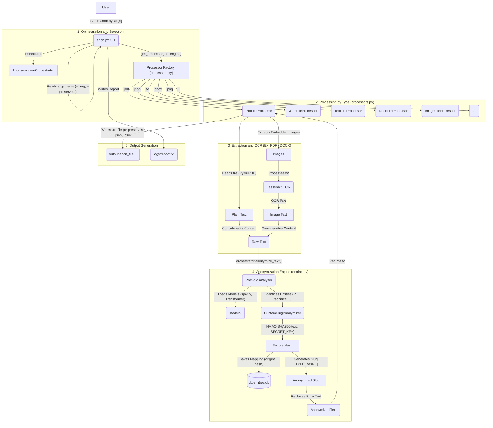

# AnonLFI 2.0: Extensible Architecture for PII Pseudonymization in CSIRTs with OCR and Technical Recognizers

AnonLFI 2.0 is a modular pseudonymization framework for CSIRTs that resolves the conflict between data confidentiality (GDPR/LGPD) and analytical utility. It uses HMAC-SHA256 to generate strong, reversible pseudonyms, natively preserves XML and JSON structures, and integrates an OCR pipeline and specialized technical recognizers to handle PII in complex security artifacts. This allows sensitive incident data to be used safely for threat analysis, detection engineering, and training AI (LLM) models.

## Table of Contents

- [System Architecture](#system-architecture)
- [Key Features](#key-features)
- [Technology Stack](#technology-stack)
- [Anonymization Mechanism](#anonymization-mechanism)
- [Database Schema](#database-schema)
- [Performance Validation](#performance-validation)
- [Supported Entities & Languages](#supported-entities--languages)
- [Repository Structure](#repository-structure)
- [Prerequisites](#prerequisites)
- [Installation and Execution](#installation-and-execution)
- [Usage](#usage)
  - [Basic Commands](#basic-commands)
  - [Command-Line Options](#command-line-options)
  - [Advanced Configuration for Structured Files](#advanced-configuration-for-structured-files)
  - [NER Data Generation Mode](#ner-data-generation-mode)
  - [Performance Optimization](#performance-optimization)
- [Architecture Deep Dive](#architecture-deep-dive)
  - [Core Components](#core-components)
  - [Processing Pipeline](#processing-pipeline)
  - [Memory Management](#memory-management)
  - [Caching Strategy](#caching-strategy)
  - [Fallback Architecture](#fallback-architecture)
- [Utility Scripts](#utility-scripts)
- [Running Tests](#running-tests)
- [License](#license)

## System Architecture

The tool is designed with a modular, layered architecture to separate responsibilities and allow for extensibility. The following diagram illustrates the main components and workflows.



## Key Features

- **Structure-Preserving Processing:** Natively processes `.json` and `.xml` files to preserve their original hierarchy, while also supporting `.txt`, `.csv`, `.pdf`, `.docx`, and `.xlsx`.
- **OCR for Images:** Automatically extracts and anonymizes text embedded in images within PDF and DOCX files. Also supports direct anonymization of image files like `.png`, `.jpeg`, `.gif`, `.bmp`, `.tiff`, `.webp`, and more.
- **Advanced Entity Recognition:** Uses Presidio and a Transformer model (`Davlan/xlm-roberta-base-ner-hrl`) for high-accuracy entity detection.
- **Cybersecurity-Focused Recognizers:** Includes custom logic to detect specific patterns like IP addresses, URLs, hostnames, hashes, UUIDs, CVE IDs, CPE strings, certificate serials, MAC addresses, file paths, PGP blocks, and more.
- **Consistent & Secure Anonymization:** Generates stable HMAC-SHA256-based slugs for each unique entity.
- **Controlled De-anonymization:** A separate script allows for retrieving original data from a slug, protected by the same secret key.
- **Configurable:** Allows preserving specific entity types, adding terms to an allow-list, and customizing the anonymized slug length.
- **Directory Processing:** Can process a single file or recursively process all supported files in a directory.
- **NER Data Generation Mode:** Can generate training data for Named Entity Recognition models in JSONL format instead of anonymizing.
- **Performance Optimizations:** Includes caching, batch processing, fast-path strategies, configurable database modes, and memory management options.
- **Fallback Architecture:** Implements robust error handling with automatic fallback to item-by-item processing when batch integrity issues are detected.

## Technology Stack

This tool is built on top of a powerful stack of open-source libraries:

- **[Presidio](https://microsoft.github.io/presidio/):** Core engine for PII identification and anonymization.
- **[spaCy](https://spacy.io/) & [Hugging Face Transformers](https://huggingface.co/docs/transformers/index):** For state-of-the-art NLP and Named Entity Recognition (NER).
- **[Pandas](https://pandas.pydata.org/):** For efficient processing of structured data formats like CSV and XLSX.
- **[PyMuPDF](https://pymupdf.readthedocs.io/en/latest/) & [python-docx](https://python-docx.readthedocs.io/en/latest/):** For parsing PDF and DOCX files.
- **[Pytesseract](https://github.com/madmaze/pytesseract):** For OCR capabilities to extract text from images.
- **[ijson](https://github.com/ICRAR/ijson):** For streaming large JSON files efficiently.
- **[orjson](https://github.com/ijl/orjson):** For fast JSON serialization/deserialization.
- **[openpyxl](https://openpyxl.readthedocs.io/):** For Excel file processing.
- **[lxml](https://lxml.de/):** For robust XML parsing and processing.

## Anonymization Mechanism

The integrity of the anonymization process is guaranteed by a secure and consistent hashing mechanism. For each sensitive entity detected (e.g., a person's name), the system performs the following steps:

1. The entity's text is normalized to remove extra spaces.
2. An **HMAC-SHA256** hash is generated from the normalized text, using the `ANON_SECRET_KEY` as a secret key. This ensures the hash is unique and impossible to recreate without the key.
3. The full hash (64 characters) is used as a unique and persistent identifier in the database.
4. A "slug" (a prefix of the full hash, with a customizable length via `--slug-length`) is used for substitution in the text, making the output more readable.

This process ensures that the same entity (e.g., "John Doe") will always be replaced by the same slug (e.g., `[PERSON_a1b2c3d4]`), maintaining referential consistency in the anonymized data, which is crucial for training AI models.

## Database Schema

The tool uses a SQLite database (`db/entities.db`) to persist the mapping between original entities and their anonymized slugs. The main table, `entities`, has the following structure:

| Column | Type | Description |
| :--- | :--- | :--- |
| `id` | INTEGER | Primary key. |
| `entity_type` | TEXT | The type of the entity (e.g., `PERSON`, `LOCATION`). |
| `original_name` | TEXT | The original text of the detected entity. |
| `slug_name` | TEXT | The short hash (slug) displayed in the anonymized text. |
| `full_hash` | TEXT | The full HMAC-SHA256 hash, used as a unique identifier (UNIQUE constraint). |
| `first_seen` | TEXT | Timestamp of when the entity was first seen. |
| `last_seen` | TEXT | Timestamp of when the entity was last seen. |

An index on `full_hash` ensures fast lookups.

## Performance Validation

The tool's effectiveness was validated in two representative case studies from the research paper, demonstrating high precision in complex scenarios:

| Scenario | Description | Precision | Recall | F1-Score |
| :--- | :--- | :--- | :--- | :--- |
| **PDF with OCR** | An incident report with PII in text and embedded terminal screenshots. | 100% | 61.9% | 76.5% |
| **OpenVAS XML** | A vulnerability report with nested technical entities (hashes, certs, etc.). | 100% | 85.42% | 92.13% |

The results confirm the engine's accuracy and the value of the specialized OCR and technical recognizers.

## Supported Entities & Languages

### Entities

By default, the tool is configured to detect and anonymize a wide range of PII and cybersecurity-related entities:

- `AUTH_TOKEN` - Authentication tokens and session IDs
- `CERT_BODY` - Base64-encoded certificate bodies (e.g., PEM format)
- `CERT_SERIAL` - Certificate serial numbers
- `CPE_STRING` - Common Platform Enumeration identifiers
- `CREDIT_CARD` - Credit card numbers
- `CVE_ID` - Common Vulnerabilities and Exposures identifiers
- `EMAIL_ADDRESS` - Email addresses
- `FILE_PATH` - User home directory paths
- `HASH` - Cryptographic hashes (SHA256, MD5, etc.)
- `HOSTNAME` - Fully qualified domain names and hostnames
- `IP_ADDRESS` - IPv4 and IPv6 addresses
- `LOCATION` - Geographic locations
- `MAC_ADDRESS` - MAC addresses
- `ORGANIZATION` - Organization names
- `PASSWORD` - Contextual passwords from key=value pairs
- `PERSON` - Person names
- `PGP_BLOCK` - PGP signature and public key blocks
- `PHONE_NUMBER` - Phone numbers (including Brazilian CPF format)
- `URL` - Web URLs
- `USERNAME` - Contextual usernames from key=value pairs
- `UUID` - Universally Unique Identifiers

*This list can be retrieved by running `uv run anon.py --list-entities`.*

### Languages

The tool is pre-configured for **24 languages**:

| Code | Language |
| :--- | :--- |
| `ca` | Catalan |
| `zh` | Chinese |
| `hr` | Croatian |
| `da` | Danish |
| `nl` | Dutch |
| `en` | English |
| `fi` | Finnish |
| `fr` | French |
| `de` | German |
| `el` | Greek |
| `it` | Italian |
| `ja` | Japanese |
| `ko` | Korean |
| `lt` | Lithuanian |
| `mk` | Macedonian |
| `nb` | Norwegian Bokmål |
| `pl` | Polish |
| `pt` | Portuguese |
| `ro` | Romanian |
| `ru` | Russian |
| `sl` | Slovenian |
| `es` | Spanish |
| `sv` | Swedish |
| `uk` | Ukrainian |

*For a full list of supported languages, run `uv run anon.py --list-languages`.*

## Repository Structure

```
.
├── anon.py                # Main CLI entry point for the tool
├── scripts/               # Utility scripts (e.g., deanonymize.py)
│   ├── deanonymize.py     # Reverse anonymization script
│   ├── get_metrics.py     # Aggregate performance statistics
│   ├── get_runs_metrics.py # Multiple run benchmarking
│   ├── get_ticket_count.py # Ticket counting utility
│   └── count_eng.py       # English word counter for CSVs
├── src/anon/              # Main application source code
│   ├── __init__.py
│   ├── config.py          # Configuration, constants, and database functions
│   ├── engine.py          # Core anonymization logic and Presidio orchestration
│   ├── processors.py      # File-specific processing classes (PDF, DOCX, etc.)
│   └── repository.py      # Database operations layer
├── tests/                 # Integration and unit tests
├── db/                    # (Generated) SQLite database for entity storage
├── logs/                  # (Generated) Execution reports
├── models/                # (Generated) Downloaded NLP models
├── output/                # (Generated) Anonymized output files
├── pyproject.toml         # Project dependencies for `uv`
├── uv.lock                # Locked dependency versions
└── README.md              # This file
```

## Prerequisites

1. **`uv` Tool**:
   - **Windows:** `powershell -ExecutionPolicy ByPass -c "irm https://astral.sh/uv/install.ps1 | iex"`
   - **Linux/macOS:** `curl -LsSf https://astral.sh/uv/install.sh | sh`

2. **Tesseract OCR**:
   - Required to extract text from images in PDF and DOCX files.
   - **Ubuntu/Debian:** `sudo apt update && sudo apt install tesseract-ocr`
   - **macOS (Homebrew):** `brew install tesseract`
   - **Windows:** Download the installer from the [Tesseract documentation](https://github.com/tesseract-ocr/tesseract#installing-tesseract) and add the installation path to the `PATH` environment variable.

## Installation and Execution

1. **Clone the repository:**
   ```bash
   git clone https://github.com/AnonShield/AnonLFI2.0.git
   cd AnonLFI2.0
   ```

2. **Set the Secret Key (Mandatory for Anonymization):**
   The system's security depends on a secret key. **The tool will not run anonymization without it.**
   - **Linux/macOS:** `export ANON_SECRET_KEY='your-super-secret-key-here'`
   - **Windows (PowerShell):** `$env:ANON_SECRET_KEY='your-super-secret-key-here'`

3. **Install Dependencies:**
   ```bash
   uv sync
   ```
   *On the first run, the required AI models will be downloaded, which may take a few minutes.*

## Usage

Anonymized files are saved in the `output/` directory with the format `anon_{original_filename}.ext`.

### Basic Commands

**Anonymize a file or directory:**

```bash
# Process a single file
uv run anon.py path/to/your/file.txt

# Process an entire directory
uv run anon.py path/to/your/directory/
```

**De-anonymize a Slug:**

```bash
uv run scripts/deanonymize.py "[PERSON_a1b2c3d4]"
```

**List supported entities:**

```bash
uv run anon.py --list-entities
```

**List supported languages:**

```bash
uv run anon.py --list-languages
```

### Command-Line Options

#### Required Arguments

- `file_path`: The path to the target file or directory to be processed.

#### Mode Selection

- `--generate-ner-data`: Enable NER data generation mode instead of anonymizing. Generates training data in JSONL format.

#### General Options

- `--lang <code>`: Sets the document's language (e.g., `en`, `pt`). Default: `en`.
- `--output-dir <PATH>`: Directory to save output files. Default: `output`.
- `--overwrite`: Allows overwriting of existing output files.
- `--no-report`: Disables the creation of a performance report in the `logs` directory.
- `--log-level <LEVEL>`: Set the logging level. Options: `DEBUG`, `INFO`, `WARNING`, `ERROR`, `CRITICAL`. Default: `WARNING`.

#### Anonymization Options

- `--preserve-entities <TYPES>`: A comma-separated list of entity types to *not* anonymize (e.g., `"LOCATION,HOSTNAME"`).
- `--allow-list <TERMS>`: A comma-separated list of terms to ignore during anonymization.
- `--slug-length <NUM>`: Sets the character length of the hash in the slug (1-64). Defaults to the full 64-character hash.
- `--anonymization-config <PATH>`: Path to a JSON file with advanced rules for structured files (see Advanced Configuration section).

#### Performance & Filtering Options

- `--optimize`: A shorthand to enable all performance optimizations (`--anonymization-strategy fast`, `--db-mode in-memory`, `--use-cache`, and `--min-word-length 3`).
- `--use-cache`: Enables in-memory caching for the run to speed up repeated anonymizations. Disabled by default.
- `--max-cache-size <NUM>`: Maximum number of items to store in the in-memory cache. Default: `10000`.
- `--min-word-length <NUM>`: Minimum character length for a word to be processed. Default: `0` (no limit).
- `--technical-stoplist <TERMS>`: A comma-separated list of custom words to add to the technical stoplist.
- `--skip-numeric`: If set, numeric-only strings will not be anonymized.
- `--anonymization-strategy <strategy>`: Anonymization strategy. Options: `presidio` (full analysis with Presidio), `fast` (optimized path using spaCy directly). Default: `presidio`.
- `--regex-priority`: Give priority to custom regex recognizers over model-based ones (adds 0.15 to regex pattern scores).
- `--db-mode <MODE>`: Sets the database mode. Options: `persistent` (saves to disk), `in-memory` (temporary database). Default: `persistent`.
- `--db-synchronous-mode <MODE>`: Sets the SQLite `synchronous` PRAGMA for the database connection. Options: `OFF`, `NORMAL`, `FULL`, `EXTRA`. Overrides config file setting.
- `--disable-gc`: Disables automatic garbage collection during processing. May boost speed for large single files but increases memory usage.

#### Example Commands

**Basic anonymization with custom slug length:**
```bash
uv run anon.py incident_report.pdf --lang en --slug-length 12
```

**Preserve hostnames and use optimization:**
```bash
uv run anon.py /path/to/directory/ --preserve-entities "HOSTNAME" --optimize
```

**Generate NER training data:**
```bash
uv run anon.py training_data.json --generate-ner-data
```

**Use advanced configuration for structured file:**
```bash
uv run anon.py vulnerability_scan.json --anonymization-config config.json
```

**Enable caching and set minimum word length:**
```bash
uv run anon.py large_file.csv --use-cache --min-word-length 3
```

### Advanced Configuration for Structured Files

For structured files like `.json`, `.csv`, and `.xml`, you can gain granular control over the anonymization process using a JSON configuration file passed with the `--anonymization-config` argument.

The configuration file supports three main keys:

- `fields_to_exclude`: A list of dot-notation paths to fields that should **never** be anonymized (e.g., `["metadata.id"]`). This acts as a high-priority deny-list.
- `fields_to_anonymize`: A list of dot-notation paths to fields that should be anonymized using the tool's automatic entity detection. If this key or `force_anonymize` is present, the tool enters **explicit mode**, and only fields matching these lists will be considered for anonymization.
- `force_anonymize`: A dictionary where keys are dot-notation paths and values are objects specifying a forced `entity_type`. This is useful for custom entities or for improving accuracy on fields with known formats.

#### Explicit vs. Implicit Mode

- **Implicit Mode (Default):** If neither `fields_to_anonymize` nor `force_anonymize` is in the config, the tool attempts to anonymize all fields except those in `fields_to_exclude`.
- **Explicit Mode:** If `fields_to_anonymize` or `force_anonymize` is present, only fields listed in one of them will be processed. All other fields are ignored.

#### Priority Order

1. **Highest Priority:** `fields_to_exclude` - Always prevents anonymization
2. **Second Priority:** `force_anonymize` - Always triggers anonymization (bypasses text-based filters)
3. **Text-based filters:** Stop-words, numeric-only, `min_word_length`
4. **Mode-based logic:** Explicit vs. implicit mode determines default behavior

#### Example Configuration

```json
{
  "fields_to_exclude": [
    "scan.id",
    "asset.tags.category"
  ],
  "fields_to_anonymize": [
    "asset.tags.value",
    "asset.ipv4_addresses",
    "scan.target"
  ],
  "force_anonymize": {
    "asset.name": {
      "entity_type": "CUSTOM_ASSET_NAME"
    }
  }
}
```

When this configuration is used:
- `scan.id` and `asset.tags.category` will be ignored because they are in the deny-list.
- The content of `asset.name` will be anonymized with the entity type `CUSTOM_ASSET_NAME`.
- The contents of `asset.tags.value`, `asset.ipv4_addresses`, and `scan.target` will be anonymized using the default entity detection.
- Any other field not listed in `fields_to_anonymize` or `force_anonymize` (like `asset.display_ipv4_address`) will also be ignored because the configuration enables explicit mode.

### NER Data Generation Mode

The tool can generate Named Entity Recognition (NER) training data instead of anonymizing. This mode:

- Does not require `ANON_SECRET_KEY`
- Outputs data in JSONL format (one JSON object per line)
- Each line contains: `{"text": "...", "label": [[start, end, entity_type], ...]}`
- Useful for training custom NER models

**Example:**
```bash
uv run anon.py training_corpus/ --generate-ner-data --output-dir ner_output/
```

### Performance Optimization

The tool provides several optimization strategies:

#### Quick Optimization (Recommended)

Use the `--optimize` flag to enable all optimizations at once:

```bash
uv run anon.py large_dataset/ --optimize
```

This enables:
- Fast anonymization strategy (bypasses Presidio, uses spaCy directly)
- In-memory database (no disk I/O)
- Caching enabled
- Minimum word length of 3 characters

#### Manual Optimization

For fine-tuned control, use individual flags:

**Caching:**
```bash
uv run anon.py file.csv --use-cache --max-cache-size 50000
```

**Fast Strategy:**
```bash
uv run anon.py file.json --anonymization-strategy fast
```

**In-Memory Database:**
```bash
uv run anon.py file.xml --db-mode in-memory
```

**Disable Garbage Collection (for single large files):**
```bash
uv run anon.py huge_file.pdf --disable-gc
```

**Database Tuning:**
```bash
uv run anon.py dataset/ --db-synchronous-mode OFF
```

## Architecture Deep Dive

### Core Components

#### 1. CLI Layer (`anon.py`)

The command-line interface orchestrates the entire process:
- Parses arguments and validates configuration
- Checks and downloads required NLP models
- Initializes the database and writer thread
- Creates the `AnonymizationOrchestrator`
- Dispatches files to appropriate processors
- Generates performance reports

#### 2. Anonymization Orchestrator (`engine.py`)

The `AnonymizationOrchestrator` is the core engine:

**Responsibilities:**
- Manages Presidio analyzers and anonymizers
- Loads custom regex recognizers for cybersecurity entities
- Provides multiple anonymization strategies (`presidio`, `fast`)
- Implements caching with LRU eviction
- Handles entity detection for NER data generation
- Maintains entity statistics

**Key Methods:**
- `anonymize_text()`: Single text anonymization
- `anonymize_texts()`: Batch text anonymization with strategy dispatch
- `detect_entities()`: Entity detection for NER data generation
- `_anonymize_texts_presidio()`: Full Presidio pipeline
- `_anonymize_texts_fast_path()`: Optimized spaCy-only pipeline
- `_anonymize_texts_forced_type()`: Force a specific entity type
- `_anonymize_texts_pick_one()`: Choose best entity from multiple options

**Anonymization Strategies:**

1.  **Presidio Strategy (Comprehensive):**
    -   **How it works:** Uses the full Presidio `AnalyzerEngine` pipeline. This involves a comprehensive analysis by **all** available recognizers: the **Transformer model + spaCy** pipeline, the **custom regex patterns**, and **dozens of Presidio's built-in recognizers** (for specific national IDs, credit cards, etc.). Results from all these sources are then aggregated by a sophisticated logic to resolve conflicts and determine the best entity.
    -   **Pros:** Highest accuracy and broadest detection capability.
    -   **Cons:** Slower due to the extensive analysis and complex aggregation.

2.  **Fast Strategy (Optimized for Speed):**
    -   **How it works:** This strategy is designed for maximum speed by completely bypassing the full `AnalyzerEngine`. It runs a direct, manual pipeline:
        1.  Passes the text through the **spaCy + Transformer** pipeline (as configured by Presidio's `TransformersNlpEngine`).
        2.  In parallel, passes the text through the **custom regex patterns**.
        3.  Uses a simpler, custom merge logic (`_merge_overlapping_entities`) to combine the results from these two sources.
        4.  Reconstructs the text manually without the `AnonymizerEngine`'s full pipeline.
    -   **Pros:** Significantly faster by eliminating the `AnalyzerEngine`'s overhead and its numerous internal recognizers.
    -   **Cons:** Less robust in resolving entity conflicts and does not benefit from the full range of Presidio's additional recognizers.

3.  **Balanced Strategy ( Optimal Balance):**
    -   **How it works:** This strategy offers a smart middle ground. It *uses* the Presidio `AnalyzerEngine` (thus benefiting from its more robust result aggregation logic than `fast` mode), but it invokes it selectively. Instead of using all recognizers, it instructs the engine to use **only** the main **spaCy + Transformer** pipeline and the **custom regex patterns**, effectively disabling Presidio's other built-in recognizers.
    -   **Pros:** Offers an ideal balance, being faster than `presidio` (by ignoring many internal recognizers) and more robust than `fast` (by using Presidio's superior aggregation logic).
    -   **Cons:** May not detect very specific entities that only the full `presidio` strategy would cover.

#### 3. File Processors (`processors.py`)

Uses the Template Method Pattern with a base `FileProcessor` class and specialized subclasses:

**Base Class (`FileProcessor`):**
- Defines the main workflow: extract → process → output
- Implements batch processing logic
- Handles optimization setup/cleanup
- Manages NER data generation pipeline

**Specialized Processors:**

- **`TextFileProcessor`:** Line-by-line processing for `.txt`, `.log` files
- **`ImageFileProcessor`:** OCR extraction for image files
- **`DocxFileProcessor`:** Paragraph and embedded image extraction
- **`PdfFileProcessor`:** Text block and image extraction with spatial sorting
- **`CsvFileProcessor`:** Efficient column-wise processing with translation maps
- **`XlsxFileProcessor`:** Excel workbook processing with in-memory translation
- **`XmlFileProcessor`:** Structure-preserving XML processing with XPath tracking
- **`JsonFileProcessor`:** Hybrid JSON/JSONL processor with streaming support

**JSON Processing Modes:**

The `JsonFileProcessor` uses a sophisticated hybrid approach:

1. **JSONL Mode:** Line-by-line streaming for `.jsonl` files
2. **Small JSON Mode:** In-memory processing for files < 100 MB
3. **Large JSON Array Mode:** Streaming with `ijson` for large array files
4. **Error Handling:** Falls back to in-memory if streaming fails

#### 4. Database Layer

**Repository Pattern (`repository.py`):**

The `EntityRepository` encapsulates all database operations:
- Connection management
- Schema initialization with PRAGMA settings
- Batch insertion with `INSERT OR IGNORE`
- Lookup by slug
- Connection cleanup

**Thread-Safe Queue (`config.py`):**

Database writes are handled by a dedicated writer thread:
- Main threads put entities in a queue
- Writer thread processes queue asynchronously
- Prevents database locking issues
- Graceful shutdown with sentinel value

### Processing Pipeline

#### Text Extraction Pipeline

1. **File Reading:** Processor reads file format
2. **Content Extraction:** 
   - Plain text extraction
   - OCR for embedded images (PDF/DOCX)
   - Structure parsing (JSON/XML/CSV)
3. **Text Normalization:** Whitespace cleaning
4. **Batching:** Groups texts for efficient processing

#### Anonymization Pipeline

1. **Should Anonymize Check:**
   - Configuration-based exclusion
   - Forced anonymization
   - Text-based filtering (stoplist, min length, numeric)
   - Mode-based logic (explicit vs. implicit)

2. **Entity Detection:**
   - spaCy NER model
   - Transformer model (XLM-RoBERTa)
   - Custom regex patterns
   - Entity merging and deduplication

3. **Hash Generation:**
   - Text normalization
   - HMAC-SHA256 with secret key
   - Slug creation (configurable length)

4. **Database Storage:**
   - Queue entity for async write
   - Track entity statistics

5. **Text Replacement:**
   - Replace entity with `[TYPE_hash]` format
   - Maintain text structure

#### Structure Preservation

**JSON/XML:**
- Parse into tree structure
- Walk tree to collect strings
- Group by path and forced entity type
- Create translation map
- Reconstruct tree with anonymized values

**CSV/XLSX:**
- Process unique values per column
- Create column-aware translation map
- Apply vectorized transformations
- Preserve headers and structure

### Memory Management


The tool employs several strategies for efficient memory management, crucial for processing large files:


1.  **Streaming for Large Files:**

    -   **PDFs:** Processed page-by-page with explicit cleanup of PyMuPDF page objects (`page.clean_contents()`, `del page`) to prevent memory accumulation.

    -   **JSON:** Uses `ijson` for streaming large JSON arrays and line-by-line processing for `.jsonl` files, avoiding loading entire files into memory.

    -   **CSV/XLSX:** Processes CSV files in chunks using Pandas and XLSX files by iterating through cells without loading the full workbook at once.

2.  **Garbage Collection Control:** Provides an option to disable Python's automatic garbage collection (`--disable-gc`) for large single-file processing, which can reduce overhead at the cost of higher peak memory usage. Explicit `gc.collect()` calls are strategically placed, especially during PDF processing, to reclaim memory.


### Caching Strategy


To enhance performance, especially for repeated anonymization of the same text fragments within a single run, the tool implements an in-memory cache:


-   **LRU Cache:** Utilizes `collections.OrderedDict` to maintain a Least Recently Used (LRU) cache. When the cache limit is reached, the least recently used items are evicted.

-   **Configurable Size:** The maximum number of items in the cache can be configured via `--max-cache-size` (default: 10,000).

-   **Usage:** Caching is enabled with the `--use-cache` flag or automatically when the `--optimize` flag is used. Cached values (original text and its anonymized slug) are retrieved quickly, avoiding redundant entity detection and hashing.


### Fallback Architecture


Robust error handling is critical, especially when dealing with varied and potentially malformed input data. The tool incorporates a "Safe Fallback Mechanism" to prevent data integrity issues and potential PII leaks during batch processing:


-   **Batch Integrity Check:** After attempting to anonymize a batch of texts, the `AnonymizationOrchestrator` verifies that the number of input texts matches the number of anonymized output texts.

-   **Triggering Fallback:** If a mismatch is detected (indicating a failure in batch processing for one or more items), the `_safe_fallback_processing` method is invoked.

-   **Item-by-Item Processing:** The fallback mechanism re-processes the original texts one-by-one. This ensures that even if an issue occurs with a single item, it is isolated, and the remaining items can still be processed correctly. This approach guarantees atomicity and maintains alignment between input and output, preventing accidental data loss or corruption.

-   **Error Handling:** Errors during fallback processing are logged, and in critical cases, the original text for the problematic item is returned to maintain file structure, preventing a complete processing halt and ensuring data alignment in structured files like CSVs or JSONs. This prevents the system from crashing or outputting an incomplete or misaligned file, which could inadvertently lead to PII exposure.


## Utility Scripts


The `scripts/` directory contains several helper scripts:


-   `count_eng.py`: A script to count English words in a given text, potentially useful for linguistic analysis or data profiling.

-   `deanonymize.py`: A crucial utility that allows for the controlled reversal of anonymization. Given a generated slug and the `ANON_SECRET_KEY`, it retrieves the original sensitive data from the database.

-   `get_metrics.py`: Aggregates and reports performance statistics from anonymization runs.

-   `get_runs_metrics.py`: Designed for benchmarking, this script collects metrics from multiple anonymization runs.

-   `get_ticket_count.py`: A specialized utility for counting entries or tickets, likely within specific data formats used by CSIRTs.


## Running Tests


The project uses `unittest` for its test suite. To run all tests, ensure you have the `uv` tool and project dependencies installed, then execute:


```bash

uv run python -m unittest discover tests/

```


This command will discover and run all test cases located in the `tests/` directory. Individual test files or classes can also be run specifically if needed (e.g., `uv run python -m unittest tests.test_anon_integration`).


## License


This project is licensed under the Apache 2.0 License. See the [LICENSE](LICENSE) file for details.