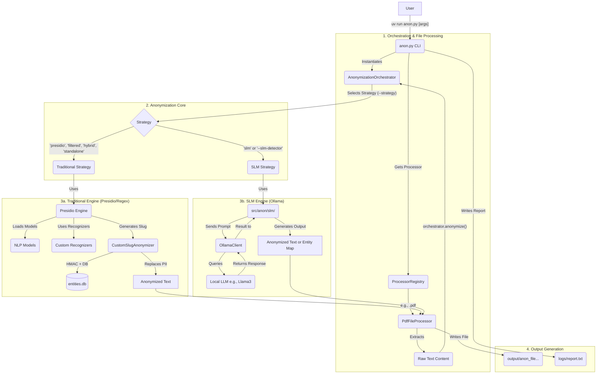

# AnonLFI 3.0: Extensible Architecture for PII Pseudonymization in CSIRTs with OCR and Technical Recognizers

AnonLFI 3.0 is a modular pseudonymization framework for CSIRTs that resolves the conflict between data confidentiality (GDPR/LGPD) and analytical utility. It uses HMAC-SHA256 to generate strong, reversible pseudonyms, natively preserves XML and JSON structures, and integrates an OCR pipeline and specialized technical recognizers to handle PII in complex security artifacts. This allows sensitive incident data to be used safely for threat analysis, detection engineering, and training AI (LLM) models.

## Table of Contents

- [Key Features](#key-features)
- [Prerequisites](#prerequisites)
- [Setup and Execution](#setup-and-execution)
- [Usage](#usage)
  - [Basic Commands](#basic-commands)
  - [SLM Integration (Experimental)](#slm-integration-experimental)
  - [Command-Line Options](#command-line-options)
  - [Advanced Configuration for Structured Files](#advanced-configuration-for-structured-files)
  - [NER Data Generation Mode](#ner-data-generation-mode)
  - [Performance Optimization](#performance-optimization)
- [System Architecture](#system-architecture)
- [Technology Stack](#technology-stack)
- [Anonymization Mechanism](#anonymization-mechanism)
- [Database Schema](#database-schema)
- [Supported Entities & Languages](#supported-entities--languages)
- [Anonymization Strategies](#anonymization-strategies)
- [Repository Structure](#repository-structure)
- [Architecture Deep Dive](#architecture-deep-dive)
  - [Core Components](#core-components)
  - [Processing Pipeline](#processing-pipeline)
  - [Memory Management](#memory-management)
  - [Caching Strategy](#caching-strategy)
  - [Fallback Architecture](#fallback-architecture)
- [Utility Scripts](#utility-scripts)
- [Running Tests](#running-tests)
- [Benchmarking](#benchmarking)
- [Documentation](#documentation)
- [License](#license)

## Key Features

- **Structure-Preserving Processing:** Natively processes `.json` and `.xml` files to preserve their original hierarchy, while also supporting `.txt`, `.csv`, `.pdf`, `.docx`, and `.xlsx`.
- **OCR for Images:** Automatically extracts and anonymizes text embedded in images within PDF and DOCX files. Also supports direct anonymization of image files like `.png`, `.jpeg`, `.gif`, `.bmp`, `.tiff`, `.webp`, and more.
- **Advanced Entity Recognition:** Uses Presidio and a Transformer model (`Davlan/xlm-roberta-base-ner-hrl`) for high-accuracy entity detection.
- **SLM-Powered Anonymization (Experimental):** Integrates Small Language Models (SLMs) via Ollama for three advanced tasks: generating entity maps for analysis, acting as a powerful entity detector, or performing end-to-end contextual anonymization.
- **Cybersecurity-Focused Recognizers:** Includes custom logic to detect specific patterns like IP addresses, URLs, hostnames, hashes, UUIDs, CVE IDs, CPE strings, certificate serials, MAC addresses, file paths, PGP blocks, and more.
- **Consistent & Secure Anonymization:** Generates stable HMAC-SHA256-based slugs for each unique entity.
- **Controlled De-anonymization:** A separate script allows for retrieving original data from a slug, protected by the same secret key.
- **Configurable:** Allows preserving specific entity types, adding terms to an allow-list, and customizing the anonymized slug length.
- **Directory Processing:** Can process a single file or recursively process all supported files in a directory.
- **NER Data Generation Mode:** Can generate training data for Named Entity Recognition models in JSONL format instead of anonymizing.
- **Performance Optimizations:** Includes caching, batch processing, fast-path strategies, configurable database modes, and memory management options.
- **Fallback Architecture:** Implements robust error handling with automatic fallback to item-by-item processing when batch integrity issues are detected.

## Prerequisites

> **For evaluators/reviewers:** The quickest way to reproduce results is using Docker (see [Docker Usage](#docker-usage-recommended)). For local execution, see [Local Installation](#local-installation-with-uv).

### Docker Usage (Recommended)

When using Docker via `run.sh`, the only prerequisites are:

1. **[Docker](https://docs.docker.com/get-docker/)** and **[Docker Compose](https://docs.docker.com/compose/install/)**
2. **For GPU acceleration:** [NVIDIA Container Toolkit](https://docs.nvidia.com/datacenter/cloud-native/container-toolkit/latest/install-guide.html)

Tesseract OCR, Ollama, spaCy models, and transformer models are all handled automatically inside the container (lazy-loaded on first use, persisted in Docker volumes).

### Local Installation

For running without Docker, the following are required:

1.  **`uv` Tool** (recommended) or **`pip`**:
    - **Windows:** `powershell -ExecutionPolicy ByPass -c "irm https://astral.sh/uv/install.ps1 | iex"`
    - **Linux/macOS:** `curl -LsSf https://astral.sh/uv/install.sh | sh`

2.  **Tesseract OCR** (for OCR features):
    - **Ubuntu/Debian:** `sudo apt update && sudo apt install tesseract-ocr`
    - **macOS (Homebrew):** `brew install tesseract`
    - **Windows:** Download from the [Tesseract documentation](https://github.com/tesseract-ocr/tesseract#installing-tesseract) and add to `PATH`.

3.  **Ollama** (for SLM features only):
    - Follow the [Ollama installation guide](https://ollama.com/download).
    - Pull a model: `ollama run llama3`

4. **NVIDIA GPU** (for GPU acceleration without Docker):
    - NVIDIA driver compatible with CUDA 12.8+
    - Python 3.12+

## Setup and Execution

The recommended way to run AnonLFI is by using Docker, as it simplifies dependency management and provides a consistent, isolated environment. A local installation option is also available for development or specific use cases.

### Docker Usage (Recommended)

The recommended way to run the tool is via the `run.sh` wrapper script. It provides a fully automated, "lazy-loading" experience by inspecting your commands and provisioning the necessary dependencies (like Ollama) on demand.

**Prerequisites:**
- [Docker](https://docs.docker.com/get-docker/)
- [Docker Compose](https://docs.docker.com/compose/install/)
- For GPU acceleration: A configured NVIDIA GPU with the [NVIDIA Container Toolkit](https://docs.nvidia.com/datacenter/cloud-native/container-toolkit/latest/install-guide.html).

**How it Works**
The `run.sh` script is an intelligent orchestrator that:
1.  Parses your command-line arguments.
2.  Automatically starts the `ollama` service if you use any SLM-related flags (e.g., `--slm-detector`).
3.  Automatically selects the GPU-accelerated services if you pass the `--gpu` flag and a valid NVIDIA environment is detected.
4.  Persists all downloaded models and the database in Docker volumes, making subsequent runs much faster.

**Quickstart:**

1.  **Clone the repository:**
    ```bash
    git clone https://github.com/AnonShield/AnonLFI3.0.git
    cd AnonLFI3.0
    ```

2.  **Make the script executable:**
    ```bash
    chmod +x run.sh
    ```

3.  **Prepare your data:**
    Place the files you want to anonymize in the `./data/input/` directory (create it if it doesn't exist).
    ```bash
    mkdir -p data/input
    cp /path/to/your/file.txt data/input/
    ```

4.  **Run the anonymization:**
    Simply execute `./run.sh` and pass the arguments directly to `anon.py`.

    -   **Set the Secret Key:**
        ```bash
        export ANON_SECRET_KEY='your-super-secret-key-here'
        ```

    -   **CPU-based Example:**
        ```bash
        # The script will use the default profile
        ./run.sh /data/input/file.txt --output-dir /app/output
        ```

    -   **SLM Example (CPU):**
        ```bash
        # The script will detect the --slm-detector flag and automatically start Ollama
        ./run.sh /data/input/file.txt --output-dir /app/output --slm-detector
        ```

    -   **GPU Example (no SLM):**
        ```bash
        # The --gpu flag tells the script to use the GPU-accelerated container
        ./run.sh --gpu /data/input/file.txt --output-dir /app/output
        ```

    -   **GPU + SLM Example:**
        ```bash
        # Combines GPU acceleration with SLM-powered detection
        ./run.sh --gpu /data/input/file.txt --output-dir /app/output --slm-detector
        ```

**Available Profiles:**

| Profile   | Activated When             | Services                  |
|-----------|----------------------------|---------------------------|
| `cpu`     | No special flags           | anon (CPU)                |
| `slm`     | `--slm-*` flags detected   | anon (CPU) + Ollama (CPU) |
| `gpu`     | `--gpu` flag               | anon-gpu                  |
| `gpu-slm` | `--gpu` + `--slm-*` flags  | anon-gpu + Ollama (GPU)   |

**Accessing Output Files:**

The anonymized files are saved inside a persistent Docker volume named `anon-output`. You can copy them to your local machine:

```bash
docker cp anon-cpu:/app/output ./local_output_directory
# or for GPU runs:
docker cp anon-gpu:/app/output ./local_output_directory
```

**Manual Docker Compose Usage:**

```bash
# CPU profile
docker compose -f docker/docker-compose.yml --profile cpu run --rm anon /data/input/file.txt

# GPU profile
docker compose -f docker/docker-compose.yml --profile gpu run --rm anon-gpu /data/input/file.txt

# SLM profile (start Ollama first)
docker compose -f docker/docker-compose.yml --profile slm up -d ollama
docker compose -f docker/docker-compose.yml --profile slm run --rm anon /data/input/file.txt --slm-detector
```

### Local Installation (with `uv`)

1. **Clone the repository:**
   ```bash
   git clone https://github.com/AnonShield/AnonLFI3.0.git
   cd AnonLFI3.0
   ```

2. **Set the Secret Key (Mandatory for Anonymization):**
   The system's security depends on a secret key. **The tool will not run anonymization without it.**
   - **Linux/macOS:** `export ANON_SECRET_KEY='your-super-secret-key-here'`
   - **Windows (PowerShell):** `$env:ANON_SECRET_KEY='your-super-secret-key-here'`

3. **Install Dependencies:**
   ```bash
   uv sync
   ```
   *On the first run, the required AI models will be downloaded, which may take a few minutes.*

### Local Installation with GPU (without `uv`)

This method replicates the Docker GPU environment locally using `pip`. Requires an NVIDIA GPU with drivers compatible with CUDA 12.8+.

1. **Clone the repository:**
   ```bash
   git clone https://github.com/AnonShield/AnonLFI3.0.git
   cd AnonLFI3.0
   ```

2. **Install system dependencies (Ubuntu/Debian):**
   ```bash
   sudo apt update && sudo apt install -y \
       python3.12 python3.12-venv python3.12-dev \
       tesseract-ocr tesseract-ocr-por \
       libmagic1 build-essential curl git
   ```

3. **Create and activate a virtual environment:**
   ```bash
   python3.12 -m venv .venv
   source .venv/bin/activate
   ```

4. **Install project dependencies:**
   ```bash
   pip install .
   ```

5. **Install PyTorch with CUDA 12.8 support:**
   ```bash
   pip install --force-reinstall torch --index-url https://download.pytorch.org/whl/cu128
   ```

6. **Install CuPy for GPU-accelerated operations:**
   ```bash
   pip install cupy-cuda12x==12.3.0
   ```

7. **Set the Secret Key:**
   ```bash
   export ANON_SECRET_KEY='your-super-secret-key-here'
   ```

8. **Run the tool:**
   ```bash
   python anon.py path/to/your/file.txt
   ```

   *On the first run, the required AI models will be downloaded, which may take a few minutes.*

## Usage

Anonymized files are saved in the `output/` directory with the format `anon_{original_filename}.ext`.

### Basic Commands

**Anonymize a file or directory:**

```bash
# Process a single file
uv run anon.py path/to/your/file.txt

# Process an entire directory
uv run anon.py path/to/your/directory/
```

**De-anonymize a Slug:**

```bash
uv run scripts/deanonymize.py "[PERSON_a1b2c3d4]"
```

**List supported entities:**

```bash
uv run anon.py --list-entities
```

**List supported languages:**

```bash
uv run anon.py --list-languages
```

### SLM Integration (Experimental)

The SLM integration allows you to leverage a local language model for more advanced, context-aware PII detection. It offers three distinct operational modes.

**Task 1: Map Potential Entities (for Analysis)**
This mode scans a document and generates a detailed report (`.jsonl` and `.csv`) of potential PII, along with confidence scores and reasoning from the SLM. It does not anonymize the file. It's an analytical tool to help you understand a document's PII surface or develop new recognizers.

```bash
uv run anon.py /path/to/document.txt --slm-map-entities
```
> Output: `output/document_entity_map.jsonl` and `output/document_entity_map.csv`

**Task 2: Use SLM as an Advanced Detector**
This mode incorporates the SLM as a powerful recognizer within the existing anonymization workflow. It can work in `hybrid` mode (combining its results with traditional recognizers) or `exclusive` mode (using only SLM results).

```bash
# Use SLM in hybrid mode to enhance detection
uv run anon.py report.pdf --slm-detector --slm-detector-mode hybrid
```

**Task 3: Perform End-to-End Anonymization with SLM**
This mode delegates the entire anonymization process to the SLM, which identifies and replaces PII based on contextual understanding. This can result in more readable output but does not use the HMAC-hashing mechanism.

```bash
uv run anon.py chat_logs.txt --anonymization-strategy slm
```

### Command-Line Options

#### Required Arguments

- `file_path`: The path to the target file or directory to be processed.

#### Mode Selection

- `--generate-ner-data`: Enable NER data generation mode instead of anonymizing. Generates training data in JSONL format.

#### General Options

- `--lang <code>`: Sets the document's language (e.g., `en`, `pt`). Default: `en`.
- `--output-dir <PATH>`: Directory to save output files. Default: `output`.
- `--overwrite`: Allows overwriting of existing output files.
- `--no-report`: Disables the creation of a performance report in the `logs` directory.
- `--log-level <LEVEL>`: Set the logging level. Options: `DEBUG`, `INFO`, `WARNING`, `ERROR`, `CRITICAL`. Default: `WARNING`.

#### Anonymization Options

- `--preserve-entities <TYPES>`: A comma-separated list of entity types to *not* anonymize (e.g., `"LOCATION,HOSTNAME"`).
- `--allow-list <TERMS>`: A comma-separated list of terms to ignore during anonymization.
- `--slug-length <NUM>`: Sets the character length of the hash in the slug (0-64). If 0, only the entity type is used. Default: `64`.
- `--anonymization-config <PATH>`: Path to a JSON file with advanced rules for structured files (see Advanced Configuration section).

#### SLM Options

- `--slm-map-entities`: Use SLM to map potential entities for analysis. Does not anonymize.
- `--slm-detector`: Use SLM as an entity detector alongside traditional methods.
- `--slm-detector-mode <MODE>`: Mode for the SLM detector. Options: `hybrid` (merges with traditional NER), `exclusive` (uses only SLM results). Default: `hybrid`.
- `--slm-prompt-version <VERSION>`: Specify the prompt version to use for SLM tasks (e.g., `v1`, `v2`). Default: `v1`.
- `--slm-chunk-size <NUM>`: Max character size for chunks sent to the SLM mapper.
- `--slm-confidence-threshold <FLOAT>`: Minimum confidence score for entities from the SLM mapper (0.0 to 1.0). Default: `0.7`.
- `--slm-context-window <NUM>`: Character window size for context extraction in the SLM mapper.
- `--slm-temperature <FLOAT>`: Temperature for the SLM model, controlling randomness.

#### Performance & Filtering Options

- `--optimize`: A shorthand to enable all performance optimizations (`--anonymization-strategy filtered`, `--db-mode in-memory`, `--use-cache`, and `--min-word-length 3`).
- `--use-cache`: Enables in-memory caching for the run to speed up repeated anonymizations. **Enabled by default**. Use `--no-use-cache` to disable.
- `--preserve-row-context`: For CSV/XLSX files, process every value to preserve row context, which is more accurate but slower. The default behavior is to only process unique values, which is faster.
- `--json-stream-threshold-mb <NUM>`: Sets the threshold (in MB) for streaming JSON files. Files larger than this will be streamed from disk to conserve memory. Default: `100`.
- `--max-cache-size <NUM>`: Maximum number of items to store in the in-memory cache. Default: `10000`.
- `--min-word-length <NUM>`: Minimum character length for a word to be processed. Default: `0` (no limit).
- `--technical-stoplist <TERMS>`: A comma-separated list of custom words to add to the technical stoplist.
- `--skip-numeric`: If set, numeric-only strings will not be anonymized.
- `--anonymization-strategy <strategy>`: Anonymization strategy. Options: `presidio` (full Presidio pipeline, default), `filtered` (filtered scope), `hybrid` (Presidio detection + custom replacement), `standalone` (experimental), `slm` (end-to-end SLM). Default: `presidio`.
- `--transformer-model <model>`: Transformer model for NER detection. Options: `Davlan/xlm-roberta-base-ner-hrl` (default, multilingual), `attack-vector/SecureModernBERT-NER` (cybersecurity-focused), `dslim/bert-base-NER` (English-only, fast). Default: `Davlan/xlm-roberta-base-ner-hrl`.
- `--regex-priority`: Give priority to custom regex recognizers over model-based ones (adds 0.15 to regex pattern scores).
- `--db-mode <MODE>`: Sets the database mode. Options: `persistent` (saves to disk), `in-memory` (temporary database). Default: `persistent`.
- `--db-synchronous-mode <MODE>`: Sets the SQLite `synchronous` PRAGMA for the database connection. Options: `OFF`, `NORMAL`, `FULL`, `EXTRA`. Overrides config file setting.
- `--disable-gc`: Disables automatic garbage collection during processing. May boost speed for large single files but increases memory usage.

#### Chunking & Batching Options

- `--batch-size <NUM>`: Default batch size for processing text chunks. Default: `1000`.
- `--csv-chunk-size <NUM>`: Chunk size for reading CSV files with pandas. Default: `1000`.
- `--json-chunk-size <NUM>`: Chunk size for streaming large JSON arrays. Default: `1000`.
- `--ner-chunk-size <NUM>`: Max character size for text chunks in NER data generation. Default: `1500`.
- `--nlp-batch-size <NUM>`: Batch size for spaCy's nlp.pipe() processing. Default: `500`.

#### Example Commands

**Basic anonymization with custom slug length:**
```bash
uv run anon.py incident_report.pdf --lang en --slug-length 12
```

**Preserve hostnames and use optimization:**
```bash
uv run anon.py /path/to/directory/ --preserve-entities "HOSTNAME" --optimize
```

**Generate NER training data:**
```bash
uv run anon.py training_data.json --generate-ner-data
```

**Use advanced configuration for structured file:**
```bash
uv run anon.py vulnerability_scan.json --anonymization-config config.json
```

**Enable caching and set minimum word length:**
```bash
uv run anon.py large_file.csv --use-cache --min-word-length 3
```

### Advanced Configuration for Structured Files

For structured files like `.json`, `.csv`, and `.xml`, you can gain granular control over the anonymization process using a JSON configuration file passed with the `--anonymization-config` argument.

The configuration file supports three main keys:

- `fields_to_exclude`: A list of dot-notation paths to fields that should **never** be anonymized (e.g., `["metadata.id"]`). This acts as a high-priority deny-list.
- `fields_to_anonymize`: A list of dot-notation paths to fields that should be anonymized using the tool's automatic entity detection. If this key or `force_anonymize` is present, the tool enters **explicit mode**, and only fields matching these lists will be considered for anonymization.
- `force_anonymize`: A dictionary where keys are dot-notation paths and values are objects specifying a forced `entity_type`. This is useful for custom entities or for improving accuracy on fields with known formats.

#### Explicit vs. Implicit Mode

- **Implicit Mode (Default):** If neither `fields_to_anonymize` nor `force_anonymize` is in the config, the tool attempts to anonymize all fields except those in `fields_to_exclude`.
- **Explicit Mode:** If `fields_to_anonymize` or `force_anonymize` is present, only fields listed in one of them will be processed. All other fields are ignored.

#### Priority Order

1. **Highest Priority:** `fields_to_exclude` - Always prevents anonymization
2. **Second Priority:** `force_anonymize` - Always triggers anonymization (bypasses text-based filters)
3. **Text-based filters:** Stop-words, numeric-only, `min_word_length`
4. **Mode-based logic:** Explicit vs. implicit mode determines default behavior

#### Example Configuration

```json
{
  "fields_to_exclude": [
    "scan.id",
    "asset.tags.category"
  ],
  "fields_to_anonymize": [
    "asset.tags.value",
    "asset.ipv4_addresses",
    "scan.target"
  ],
  "force_anonymize": {
    "asset.name": {
      "entity_type": "CUSTOM_ASSET_NAME"
    }
  }
}
```

When this configuration is used:
- `scan.id` and `asset.tags.category` will be ignored because they are in the deny-list.
- The content of `asset.name` will be anonymized with the entity type `CUSTOM_ASSET_NAME`.
- The contents of `asset.tags.value`, `asset.ipv4_addresses`, and `scan.target` will be anonymized using the default entity detection.
- Any other field not listed in `fields_to_anonymize` or `force_anonymize` (like `asset.display_ipv4_address`) will also be ignored because the configuration enables explicit mode.

### NER Data Generation Mode

The tool can generate Named Entity Recognition (NER) training data instead of anonymizing. This mode:

- Does not require `ANON_SECRET_KEY`
- Outputs data in JSONL format (one JSON object per line)
- Each line contains: `{"text": "...", "label": [[start, end, entity_type], ...]}`
- Useful for training custom NER models

**Example:**
```bash
uv run anon.py training_corpus/ --generate-ner-data --output-dir ner_output/
```

### Performance Optimization

The tool provides several optimization strategies:

#### Quick Optimization (Recommended)

Use the `--optimize` flag to enable all optimizations at once:

```bash
uv run anon.py large_dataset/ --optimize
```

This enables:
- Filtered anonymization strategy (Presidio with filtered scope)
- In-memory database (no disk I/O)
- Caching enabled
- Minimum word length of 3 characters

#### Manual Optimization

For fine-tuned control, use individual flags:

**Caching:**
```bash
uv run anon.py file.csv --use-cache --max-cache-size 50000
```

**Filtered Strategy:**
```bash
uv run anon.py file.json --anonymization-strategy filtered
```

**In-Memory Database:**
```bash
uv run anon.py file.xml --db-mode in-memory
```

**Disable Garbage Collection (for single large files):**
```bash
uv run anon.py huge_file.pdf --disable-gc
```

**Database Tuning:**
```bash
uv run anon.py dataset/ --db-synchronous-mode OFF
```

## System Architecture

The tool is designed with a modular, layered architecture to separate responsibilities and allow for extensibility. The following diagram illustrates the main components and workflows.



## Technology Stack

- **[Presidio](https://microsoft.github.io/presidio/):** Core engine for PII identification and anonymization.
- **[spaCy](https://spacy.io/) & [Hugging Face Transformers](https://huggingface.co/docs/transformers/index):** NLP and Named Entity Recognition (NER).
- **[Ollama](https://ollama.com/):** Local Small Language Models (SLMs) for advanced anonymization tasks.
- **[Pandas](https://pandas.pydata.org/):** Structured data processing (CSV, XLSX).
- **[PyMuPDF](https://pymupdf.readthedocs.io/en/latest/) & [python-docx](https://python-docx.readthedocs.io/en/latest/):** PDF and DOCX parsing.
- **[Pytesseract](https://github.com/madmaze/pytesseract):** OCR for text extraction from images.
- **[ijson](https://github.com/ICRAR/ijson):** Streaming large JSON files.
- **[orjson](https://github.com/ijl/orjson):** JSON serialization/deserialization.
- **[openpyxl](https://openpyxl.readthedocs.io/):** Excel file processing.
- **[lxml](https://lxml.de/):** XML parsing and processing.

## Anonymization Mechanism

For each sensitive entity detected, the system:

1. Normalizes the entity text (removes extra spaces).
2. Generates an **HMAC-SHA256** hash using the `ANON_SECRET_KEY`.
3. Stores the full hash (64 characters) as a unique identifier in the database.
4. Substitutes the entity in text with a slug of configurable length (e.g., `[PERSON_a1b2c3d4]`).

The same entity always produces the same slug, maintaining referential consistency across the anonymized output.

**Note:** The `slm` strategy uses a different, context-aware mechanism and does not rely on HMAC hashing or the database.

## Database Schema

The tool uses a SQLite database (`db/entities.db`) to persist the mapping between original entities and their anonymized slugs.

| Column | Type | Description |
| :--- | :--- | :--- |
| `id` | INTEGER | Primary key. |
| `entity_type` | TEXT | The type of the entity (e.g., `PERSON`, `LOCATION`). |
| `original_name` | TEXT | The original text of the detected entity. |
| `slug_name` | TEXT | The short hash (slug) displayed in the anonymized text. |
| `full_hash` | TEXT | The full HMAC-SHA256 hash (UNIQUE constraint). |
| `first_seen` | TEXT | Timestamp of when the entity was first seen. |
| `last_seen` | TEXT | Timestamp of when the entity was last seen. |

## Supported Entities & Languages

### Detected Entity Types

The system detects and anonymizes the following PII and technical entity types:

**Standard PII Entities:**

`PERSON`, `LOCATION`, `ORGANIZATION`, `EMAIL_ADDRESS`, `PHONE_NUMBER`, `CREDIT_CARD`, `USERNAME`, `PASSWORD`

**Cybersecurity & Technical Entities (Custom Recognizers):**

`IP_ADDRESS`, `URL`, `HOSTNAME`, `MAC_ADDRESS`, `FILE_PATH`, `HASH`, `AUTH_TOKEN`, `CVE_ID`, `CPE_STRING`, `CERT_SERIAL`, `CERTIFICATE`, `CRYPTOGRAPHIC_KEY`, `UUID`, `PGP_BLOCK`, `PORT`, `OID`

**Additional Entities (SecureModernBERT-NER model only):**

`MALWARE`, `REGISTRY_KEY`, `THREAT_ACTOR`, `PLATFORM`, `PRODUCT`, `SECTOR`, `TOOL`, `CAMPAIGN`, `MITRE_TACTIC`, `SERVICE`

**Non-PII Entities (Automatically Preserved):**

`CARDINAL`, `ORDINAL`, `QUANTITY`, `MONEY`, `PERCENT`, `TIME`, `LANGUAGE`, `LAW`, `EVENT`, `WORK_OF_ART`, `FAC`

### Supported Languages

The tool supports 24 languages for entity detection via the multilingual transformer model:

| Code | Language | Code | Language | Code | Language |
|:-----|:---------|:-----|:---------|:-----|:---------|
| `ca` | Catalan | `fr` | French | `pl` | Polish |
| `zh` | Chinese | `de` | German | `pt` | Portuguese |
| `hr` | Croatian | `el` | Greek | `ro` | Romanian |
| `da` | Danish | `it` | Italian | `ru` | Russian |
| `nl` | Dutch | `ja` | Japanese | `sl` | Slovenian |
| `en` | English | `ko` | Korean | `es` | Spanish |
| `fi` | Finnish | `lt` | Lithuanian | `sv` | Swedish |
| `mk` | Macedonian | `nb` | Norwegian Bokmål | `uk` | Ukrainian |

### Transformer Models

| Model | Scope | Languages |
|:------|:------|:----------|
| `Davlan/xlm-roberta-base-ner-hrl` (default) | General-purpose NER | Multilingual (24 languages) |
| `attack-vector/SecureModernBERT-NER` | Cybersecurity-focused NER | English |
| `dslim/bert-base-NER` | General-purpose NER | English |

## Anonymization Strategies

The anonymization logic is encapsulated in interchangeable strategy classes following the Strategy Design Pattern. Each strategy can be selected via `--anonymization-strategy`.

| Strategy | Class | Description |
|:---------|:------|:------------|
| `presidio` (default) | `FullPresidioStrategy` | Full Presidio pipeline with all available recognizers. Uses both AnalyzerEngine and AnonymizerEngine. |
| `filtered` | `FilteredPresidioStrategy` | Presidio pipeline with a curated, filtered set of recognizers. |
| `hybrid` | `HybridPresidioStrategy` | Presidio AnalyzerEngine for detection with manual text replacement instead of AnonymizerEngine. |
| `standalone` | `StandaloneStrategy` | Bypasses Presidio entirely, loading NER models directly and handling all detection and replacement manually. Experimental. |
| `slm` | `SLMAnonymizationStrategy` | Uses a local SLM via Ollama for end-to-end contextual anonymization. Does not use HMAC hashing. Experimental. |

**Custom Regex Entities:**

All Presidio-based strategies (`presidio`, `filtered`, `hybrid`) load custom regex recognizers for cybersecurity-specific patterns (IP addresses, CVE IDs, hashes, etc.). The `--regex-priority` flag increases regex recognizer scores by 0.15 to prioritize pattern-based detection over model-based detection.

**Memory Requirements:**

| Strategy | Approximate Memory |
|:---------|:-------------------|
| `presidio`, `filtered`, `hybrid` | ~2 GB (Presidio + Transformer model) |
| `standalone` | ~1.5 GB (Transformer model only) |
| `slm` | Depends on the SLM model size |

## Repository Structure

```
.
├── anon.py                          # CLI entry point
├── pyproject.toml                   # Project metadata and dependencies
├── uv.lock                          # Dependency lock file
├── run.sh                           # Docker orchestration script
├── anonymization_config.json        # Default anonymization config
├── anonymization_config_cve.json    # CVE-specific config
│
├── docker/
│   ├── Dockerfile                   # Multi-stage build (CPU + GPU)
│   ├── docker-compose.yml           # Service profiles
│   └── docker-entrypoint.sh         # Container entrypoint
│
├── src/anon/                        # Core library
│   ├── config.py                    # Entity mappings, language lists
│   ├── engine.py                    # AnonymizationOrchestrator
│   ├── strategies.py                # FullPresidio, Filtered, Hybrid strategies
│   ├── standalone_strategy.py       # StandaloneStrategy
│   ├── entity_detector.py           # NER entity detection
│   ├── processors.py                # File processors (Text, PDF, CSV, etc.)
│   ├── repository.py                # EntityRepository (SQLite)
│   ├── database.py                  # Thread-safe DB writer queue
│   ├── hash_generator.py            # HMAC-SHA256 hash generation
│   ├── cache_manager.py             # LRU cache
│   ├── security.py                  # Key validation
│   ├── model_manager.py             # Model loading and management
│   ├── tqdm_handler.py              # Progress bar handler
│   ├── core/
│   │   ├── config_loader.py         # Configuration loading
│   │   └── protocols.py             # Protocol interfaces
│   ├── evaluation/
│   │   ├── ground_truth.py          # Ground truth handling
│   │   ├── hash_tracker.py          # Hash tracking for evaluation
│   │   └── metrics_calculator.py    # Evaluation metrics
│   └── slm/
│       ├── client.py                # OllamaClient
│       ├── prompts.py               # Prompt management
│       ├── ollama_manager.py        # Ollama lifecycle management
│       ├── anonymizers/
│       │   └── slm_anonymizer.py    # SLMAnonymizationStrategy
│       ├── detectors/
│       │   └── slm_detector.py      # SLMEntityDetector
│       └── mappers/
│           └── entity_mapper.py     # Entity mapping
│
├── prompts/                         # SLM prompt templates
│   ├── entity_detector/             # Detector prompts (v1–v4)
│   ├── entity_mapper/               # Mapper prompts (v1, v11)
│   └── full_anonymizer/             # Anonymizer prompts (v1)
│
├── scripts/                         # Utility scripts
│   ├── deanonymize.py               # Controlled de-anonymization
│   ├── evaluate.py                  # Evaluation metrics
│   ├── create_ground_truth.py       # Ground truth generation
│   ├── sample.py                    # Data sampling
│   ├── generate_cve_dataset.py      # CVE dataset generation
│   ├── analyze_entity_map.py        # Entity map analysis
│   ├── analyze_json.py              # JSON analysis
│   ├── cluster_entities.py          # Entity clustering (HDBSCAN)
│   ├── get_metrics.py               # Performance statistics
│   ├── get_runs_metrics.py          # Multi-run metrics
│   ├── get_ticket_count.py          # Ticket counting
│   ├── count_eng.py                 # English word counting
│   ├── export_and_clear_db.py       # DB export/clear
│   ├── slm_regex_generator.py       # SLM-based regex generation
│   ├── estimate.py                  # Size estimation
│   ├── estimate_regression.py       # Regression estimation
│   ├── generate_heatmap_chart.py    # Heatmap visualization
│   └── utils.py                     # Shared utilities
│
├── tests/                           # Test suite
│   ├── test_anon_integration.py     # Integration tests
│   ├── test_anon_config.py          # Configuration tests
│   ├── test_json_anonymization.py   # JSON processing tests
│   ├── test_pii_leak.py             # PII leak detection tests
│   ├── test_security.py             # Security tests
│   ├── test_secret_key_validation.py
│   ├── test_deanonymization.py      # De-anonymization tests
│   ├── test_evaluation.py           # Evaluation tests
│   ├── test_slm_cache.py            # SLM cache tests
│   ├── test_slm_detector.py         # SLM detector tests
│   └── ...                          # Additional test modules
│
├── benchmark/                       # Benchmarking suite
│   ├── benchmark.py                 # Main benchmark orchestrator
│   ├── analyze_benchmark_scientific.py  # Statistical analysis
│   ├── visualization/               # Charts and visualization
│   │   ├── charts.py                # Chart generation
│   │   ├── config.py                # Visualization config
│   │   └── statistics.py            # Statistical computations
│   ├── orchestrated_results/        # Benchmark results
│   ├── overhead_calibration/        # Overhead measurement
│   └── README.md                    # Benchmark documentation
│
├── docs/                            # Documentation
│   ├── ANONYMIZATION_STRATEGIES.md  # Strategy technical guide
│   ├── EVALUATION_GUIDE.md          # Quality evaluation workflow
│   ├── SLM_INTEGRATION_GUIDE.md     # SLM architecture guide
│   ├── UTILITY_SCRIPTS_GUIDE.md     # Scripts reference
│   └── cluster_analysis_documentation.md  # Clustering guide
│
└── examples/
    └── teste-exemplo-artigo.txt     # Example input file
```

## Architecture Deep Dive

The architecture is designed for modularity, testability, and extensibility, following SOLID principles.

### Core Components

#### 1. CLI Layer (`anon.py`)

The command-line interface is the application's **composition root**. It is responsible for:
- Parsing arguments and validating configuration.
- Instantiating and "wiring up" all core components (e.g., `CacheManager`, `HashGenerator`, `EntityDetector`, `DatabaseContext`).
- Injecting these dependencies into the `AnonymizationOrchestrator`.
- Dispatching files to the appropriate `FileProcessor`.
- Generating performance reports.

#### 2. Anonymization Orchestrator (`engine.py`)

The `AnonymizationOrchestrator` is the central coordinator of the anonymization process. Its responsibilities have been refined to focus on high-level orchestration rather than low-level implementation:

**Responsibilities:**
- Initializes and holds the Presidio `AnalyzerEngine` and `AnonymizerEngine`.
- Selects the appropriate anonymization strategy (`presidio`, `filtered`, `hybrid`, `standalone`, `slm`) based on user input.
- Injects the required dependencies (engines, detectors, etc.) into the chosen strategy.
- Manages the overall workflow, including the fallback mechanism for batch processing failures.
- Collects and maintains entity statistics for reporting.
- Dispatches special-case anonymization (e.g., `forced_entity_type`).

**Anonymization Strategies (`strategies.py`, `slm/anonymizers/slm_anonymizer.py`):**

The core anonymization logic is encapsulated within a set of interchangeable strategy classes, adhering to the **Strategy Design Pattern**. This design allows for different performance and accuracy trade-offs without altering the main orchestration flow.

- **Decoupled Logic**: Each strategy is self-contained. It receives its required dependencies (like `analyzer_engine`, `entity_detector`, `cache_manager`) upon creation.
- **Key Strategies**:
    1.  **`FullPresidioStrategy`:** Full Presidio pipeline with all available recognizers. Uses both Presidio's AnalyzerEngine and AnonymizerEngine.
    2.  **`FilteredPresidioStrategy`:** Presidio pipeline (AnalyzerEngine + AnonymizerEngine) with a filtered, curated set of recognizers.
    3.  **`HybridPresidioStrategy`:** Presidio's AnalyzerEngine with filtered scope for entity detection, with manual text replacement in Python instead of AnonymizerEngine.
    4.  **`StandaloneStrategy` (Experimental):** Bypasses Presidio entirely, loading models directly and handling all detection and replacement manually.
    5.  **`SLMAnonymizationStrategy` (Experimental):** Uses a local SLM to perform end-to-end contextual anonymization.

#### 3. File Processors (`processors.py`)

Uses the **Template Method Pattern** with a base `FileProcessor` class and specialized subclasses.

**Base Class (`FileProcessor`):**
- Defines the main workflow: extract → process → output.
- Implements batch processing and error handling logic.
- Manages NER data generation pipeline.

**Specialized Processors:**
- **`TextFileProcessor`:** Line-by-line processing for `.txt`, `.log` files.
- **`ImageFileProcessor`:** OCR extraction for image files.
- **`DocxFileProcessor`:** Paragraph and embedded image extraction.
- **`PdfFileProcessor`:** Text block and image extraction with spatial sorting.
- **`CsvFileProcessor`:** Efficient column-wise processing with translation maps.
- **`XlsxFileProcessor`:** Excel workbook processing with in-memory translation.
- **`XmlFileProcessor`:** Structure-preserving XML processing with XPath tracking.
- **`JsonFileProcessor`:** Hybrid JSON/JSONL processor with streaming support.

**JSON Processing Modes:**

The `JsonFileProcessor` uses a sophisticated hybrid approach:

1. **JSONL Mode:** Line-by-line streaming for `.jsonl` files.
2. **Small JSON Mode:** In-memory processing for files < 100 MB.
3. **Large JSON Array Mode:** Streaming with `ijson` for large array files.
4. **Error Handling:** Falls back to in-memory processing if streaming fails, with clear warnings.

#### 4. Database Layer

**Repository Pattern (`repository.py`):**

The `EntityRepository` encapsulates all database operations, ensuring a clean separation between business logic and data access. It is responsible for:
- Connection management (using thread-local storage for safety).
- Schema initialization with PRAGMA settings for performance.
- Batch insertion with `INSERT OR IGNORE`.
- Entity lookup by slug.

**Thread-Safe Queue (`database.py`):**

To prevent database write locks from blocking the main processing threads, all database writes are handled asynchronously:
- The main `AnonymizationOrchestrator` places entities into a `queue.Queue`.
- A dedicated background writer thread, managed by the `DatabaseContext`, consumes items from this queue and performs the batch database operations.
- This ensures a graceful shutdown by processing all remaining items in the queue before the application exits.

### Processing Pipeline

#### Text Extraction Pipeline

1. **File Reading:** Processor reads file format
2. **Content Extraction:** 
   - Plain text extraction
   - OCR for embedded images (PDF/DOCX)
   - Structure parsing (JSON/XML/CSV)
3. **Text Normalization:** Whitespace cleaning
4. **Batching:** Groups texts for efficient processing

#### Anonymization Pipeline

1. **Should Anonymize Check:**
   - Configuration-based exclusion
   - Forced anonymization
   - Text-based filtering (stoplist, min length, numeric)
   - Mode-based logic (explicit vs. implicit)

2. **Entity Detection:**
   - **Traditional:** spaCy NER model, Transformer model (XLM-RoBERTa), Custom regex patterns.
   - **SLM-Enhanced:** `SLMEntityDetector` can be used in hybrid or exclusive mode.
   - Entity merging and deduplication.

3. **Hash Generation (Traditional Strategy):**
   - Text normalization
   - HMAC-SHA256 with secret key
   - Slug creation (configurable length)

4. **Database Storage (Traditional Strategy):**
   - Queue entity for async write
   - Track entity statistics

5. **Text Replacement:**
   - **Traditional:** Replace entity with `[TYPE_hash]` format.
   - **SLM Strategy:** The model returns the full text with replacements already made.
   - Maintain text structure.

#### Structure Preservation

**JSON/XML:**
- Parse into tree structure
- Walk tree to collect strings
- Group by path and forced entity type
- Create translation map
- Reconstruct tree with anonymized values

**CSV/XLSX:**
- Process unique values per column
- Create column-aware translation map
- Apply vectorized transformations
- Preserve headers and structure

### Memory Management

The tool employs several strategies for efficient memory management, crucial for processing large files:

1.  **Streaming for Large Files:**
    -   **PDFs:** Processed page-by-page with explicit cleanup of PyMuPDF page objects (`page.clean_contents()`, `del page`) to prevent memory accumulation.
    -   **JSON:** Uses `ijson` for streaming large JSON arrays and line-by-line processing for `.jsonl` files, avoiding loading entire files into memory.
    -   **CSV/XLSX:** Processes CSV files in chunks using Pandas and XLSX files by iterating through cells without loading the full workbook at once.

2.  **Garbage Collection Control:** Provides an option to disable Python's automatic garbage collection (`--disable-gc`) for large single-file processing, which can reduce overhead at the cost of higher peak memory usage. Explicit `gc.collect()` calls are strategically placed, especially during PDF processing, to reclaim memory.

### Caching Strategy

To enhance performance, especially for repeated anonymization of the same text fragments within a single run, the tool implements an in-memory cache:

-   **LRU Cache:** Utilizes `collections.OrderedDict` to maintain a Least Recently Used (LRU) cache. When the cache limit is reached, the least recently used items are evicted.
-   **Configurable Size:** The maximum number of items in the cache can be configured via `--max-cache-size` (default: 10,000).
-   **Usage:** Caching is enabled with the `--use-cache` flag or automatically when the `--optimize` flag is used. Cached values (original text and its anonymized slug) are retrieved quickly, avoiding redundant entity detection and hashing.

### Fallback Architecture

Robust error handling is critical, especially when dealing with varied and potentially malformed input data. The tool incorporates a "Safe Fallback Mechanism" to prevent data integrity issues and potential PII leaks during batch processing:

-   **Batch Integrity Check:** After attempting to anonymize a batch of texts, the `AnonymizationOrchestrator` verifies that the number of input texts matches the number of anonymized output texts.
-   **Triggering Fallback:** If a mismatch is detected (indicating a failure in batch processing for one or more items), the `_safe_fallback_processing` method is invoked.
-   **Item-by-Item Processing:** The fallback mechanism re-processes the original texts one-by-one. This ensures that even if an issue occurs with a single item, it is isolated, and the remaining items can still be processed correctly. This approach guarantees atomicity and maintains alignment between input and output, preventing accidental data loss or corruption.
-   **Error Handling:** Errors during fallback processing are logged, and in critical cases, the original text for the problematic item is returned to maintain file structure, preventing a complete processing halt and ensuring data alignment in structured files like CSVs or JSONs. This prevents the system from crashing or outputting an incomplete or misaligned file, which could inadvertently lead to PII exposure.

## Utility Scripts

The `scripts/` directory contains several helper scripts:

-   `deanonymize.py`: Controlled reversal of anonymization. Given a slug and the `ANON_SECRET_KEY`, retrieves original data from the database.
-   `evaluate.py`: Runs evaluation metrics against ground truth for anonymization quality assessment.
-   `create_ground_truth.py`: Generates ground truth files for evaluation.
-   `sample.py`: Data sampling utility for generating random samples from files or directories.
-   `generate_cve_dataset.py`: Generates CVE datasets following CAIS vulnerability distribution (stratified sampling).
-   `analyze_entity_map.py`: Analyzes entity maps generated by SLM mapping.
-   `analyze_json.py`: JSON file analysis utility.
-   `cluster_entities.py`: Entity clustering with sentence-transformers and HDBSCAN.
-   `get_metrics.py`: Aggregates and reports performance statistics from anonymization runs.
-   `get_runs_metrics.py`: Collects metrics from multiple anonymization runs for benchmarking.
-   `get_ticket_count.py`: Counts entries or tickets within CSIRT data formats.
-   `count_eng.py`: Counts English words in text for linguistic analysis.
-   `export_and_clear_db.py`: Exports the entity database and optionally clears it.
-   `slm_regex_generator.py`: Uses SLM to generate regex patterns from entity examples.

## Running Tests

The project uses `unittest` for its test suite. To run all tests, ensure you have the `uv` tool and project dependencies installed, then execute:

```bash
uv run python -m unittest discover tests/
```

This command will discover and run all test cases located in the `tests/` directory. Individual test files or classes can also be run specifically if needed (e.g., `uv run python -m unittest tests.test_anon_integration`).

## Benchmarking

AnonLFI includes a comprehensive benchmarking suite for comparing versions 1.0, 2.0, and 3.0 across performance, accuracy, and resource usage metrics. The benchmark framework supports:

- Cross-version comparison with 40+ performance metrics
- File format support matrix validation (TXT, CSV, JSON, XML, XLSX, DOCX, PDF, images)
- Smoke tests, time estimation, overhead calibration, and regression estimation
- Resume capability and fault tolerance
- Scientific visualization with charts and statistical analysis

For detailed documentation on running benchmarks, metrics reference, CLI options, and methodology, see [benchmark/README.md](benchmark/README.md).

## Documentation

AnonLFI provides specialized documentation for advanced features and evaluation workflows:

- **[ANONYMIZATION_STRATEGIES.md](docs/ANONYMIZATION_STRATEGIES.md)** — In-depth technical guide covering all 5 anonymization strategies, regex patterns, benchmark comparisons, entity detection analysis, and GPU configuration
- **[EVALUATION_GUIDE.md](docs/EVALUATION_GUIDE.md)** — Workflow for evaluating anonymization quality using Doccano for ground truth annotation and metrics calculation
- **[SLM_INTEGRATION_GUIDE.md](docs/SLM_INTEGRATION_GUIDE.md)** — Architecture and usage guide for the Small Language Model (SLM) integration with Ollama, covering entity detection, mapping, and full anonymization modes
- **[UTILITY_SCRIPTS_GUIDE.md](docs/UTILITY_SCRIPTS_GUIDE.md)** — Comprehensive reference for all utility scripts including sampling, dataset generation, evaluation, deanonymization, entity analysis, and clustering
- **[cluster_analysis_documentation.md](docs/cluster_analysis_documentation.md)** — HDBSCAN clustering hyperparameter tuning for entity deduplication

## License

This project is licensed under the Apache 3.0 License. See the [LICENSE](LICENSE) file for details.
