# Ideias de Diagramas para Arquitetura do AnonLFI 2.0

## 1. **Arquitetura em Camadas (Layered Architecture)**

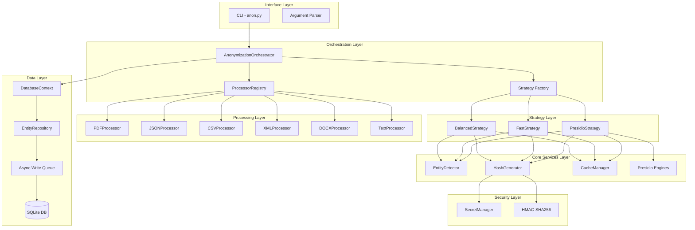
```mermaid
graph TB
    subgraph "Interface Layer"
        CLI[CLI - anon.py]
        Args[Argument Parser]
    end
    
    subgraph "Orchestration Layer"
        Orch[AnonymizationOrchestrator]
        StratFactory[Strategy Factory]
        ProcRegistry[ProcessorRegistry]
    end
    
    subgraph "Strategy Layer"
        PresidioStrat[PresidioStrategy]
        FastStrat[FastStrategy]
        BalancedStrat[BalancedStrategy]
    end
    
    subgraph "Processing Layer"
        PDF[PDFProcessor]
        JSON[JSONProcessor]
        CSV[CSVProcessor]
        XML[XMLProcessor]
        DOCX[DOCXProcessor]
        TXT[TextProcessor]
    end
    
    subgraph "Core Services Layer"
        EntityDet[EntityDetector]
        HashGen[HashGenerator]
        CacheMgr[CacheManager]
        Presidio[Presidio Engines]
    end
    
    subgraph "Data Layer"
        DBCtx[DatabaseContext]
        Repo[EntityRepository]
        Queue[Async Write Queue]
        SQLite[(SQLite DB)]
    end
    
    subgraph "Security Layer"
        SecMgr[SecretManager]
        HMAC[HMAC-SHA256]
    end
    
    CLI --> Orch
    Orch --> StratFactory
    Orch --> ProcRegistry
    StratFactory --> PresidioStrat
    StratFactory --> FastStrat
    StratFactory --> BalancedStrat
    ProcRegistry --> PDF & JSON & CSV & XML & DOCX & TXT
    
    PresidioStrat & FastStrat & BalancedStrat --> EntityDet
    PresidioStrat & FastStrat & BalancedStrat --> HashGen
    PresidioStrat & FastStrat & BalancedStrat --> CacheMgr
    PresidioStrat --> Presidio
    
    Orch --> DBCtx
    DBCtx --> Repo
    Repo --> Queue
    Queue --> SQLite
    
    HashGen --> SecMgr
    HashGen --> HMAC

```

## 2. **Fluxo de Decisão: Estratégia de Processamento**

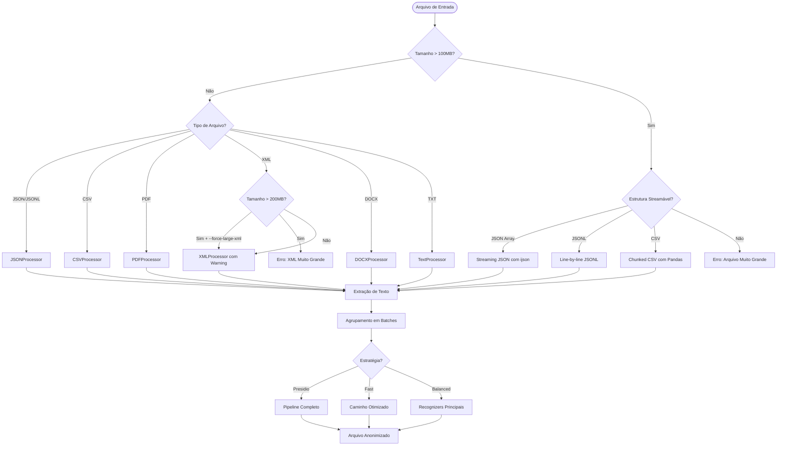
```mermaid
graph TD
    Start([Arquivo de Entrada]) --> CheckSize{Tamanho > 100MB?}
    
    CheckSize -->|Não| CheckType{Tipo de Arquivo?}
    CheckSize -->|Sim| StreamCheck{Estrutura Streamável?}
    
    StreamCheck -->|JSON Array| StreamJSON[Streaming JSON com ijson]
    StreamCheck -->|JSONL| StreamJSONL[Line-by-line JSONL]
    StreamCheck -->|CSV| ChunkCSV[Chunked CSV com Pandas]
    StreamCheck -->|Não| Error[Erro: Arquivo Muito Grande]
    
    CheckType -->|JSON/JSONL| JSONProc[JSONProcessor]
    CheckType -->|CSV| CSVProc[CSVProcessor]
    CheckType -->|PDF| PDFProc[PDFProcessor]
    CheckType -->|XML| XMLCheck{Tamanho > 200MB?}
    CheckType -->|DOCX| DOCXProc[DOCXProcessor]
    CheckType -->|TXT| TXTProc[TextProcessor]
    
    XMLCheck -->|Sim + --force-large-xml| XMLProc[XMLProcessor com Warning]
    XMLCheck -->|Sim| XMLError[Erro: XML Muito Grande]
    XMLCheck -->|Não| XMLProc
    
    JSONProc & CSVProc & PDFProc & XMLProc & DOCXProc & TXTProc --> Extract[Extração de Texto]
    StreamJSON & StreamJSONL & ChunkCSV --> Extract
    
    Extract --> Batch[Agrupamento em Batches]
    Batch --> Strategy{Estratégia?}
    
    Strategy -->|Presidio| FullPipeline[Pipeline Completo]
    Strategy -->|Fast| OptimizedPath[Caminho Otimizado]
    Strategy -->|Balanced| CoreRecognizers[Recognizers Principais]
    
    FullPipeline & OptimizedPath & CoreRecognizers --> Output[Arquivo Anonimizado]
```

## 3. **Pipeline de Detecção de Entidades (Entity Detection Pipeline)**

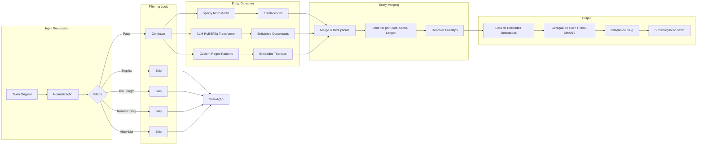
```mermaid
graph LR
    subgraph "Input Processing"
        Text[Texto Original] --> Normalize[Normalização]
        Normalize --> Filter{Filtros}
    end
    
    subgraph "Filtering Logic"
        Filter -->|Stoplist| Skip1[Skip]
        Filter -->|Min Length| Skip2[Skip]
        Filter -->|Numeric Only| Skip3[Skip]
        Filter -->|Allow List| Skip4[Skip]
        Filter -->|Pass| Continue[Continuar]
    end
    
    subgraph "Entity Detection"
        Continue --> SpaCy[spaCy NER Model]
        Continue --> Transformer[XLM-RoBERTa Transformer]
        Continue --> Regex[Custom Regex Patterns]
        
        SpaCy --> Entities1[Entidades PII]
        Transformer --> Entities2[Entidades Contextuais]
        Regex --> Entities3[Entidades Técnicas]
    end
    
    subgraph "Entity Merging"
        Entities1 & Entities2 & Entities3 --> Merge[Merge & Deduplicate]
        Merge --> Sort[Ordenar por Start, Score, Length]
        Sort --> Resolve[Resolver Overlaps]
    end
    
    subgraph "Output"
        Resolve --> Final[Lista de Entidades Detectadas]
        Final --> Hash[Geração de Hash HMAC-SHA256]
        Hash --> Slug[Criação de Slug]
        Slug --> Replace[Substituição no Texto]
    end
    
    Skip1 & Skip2 & Skip3 & Skip4 --> NoAction[Sem Ação]

```

## 4. **Arquitetura de Cache e Performance**

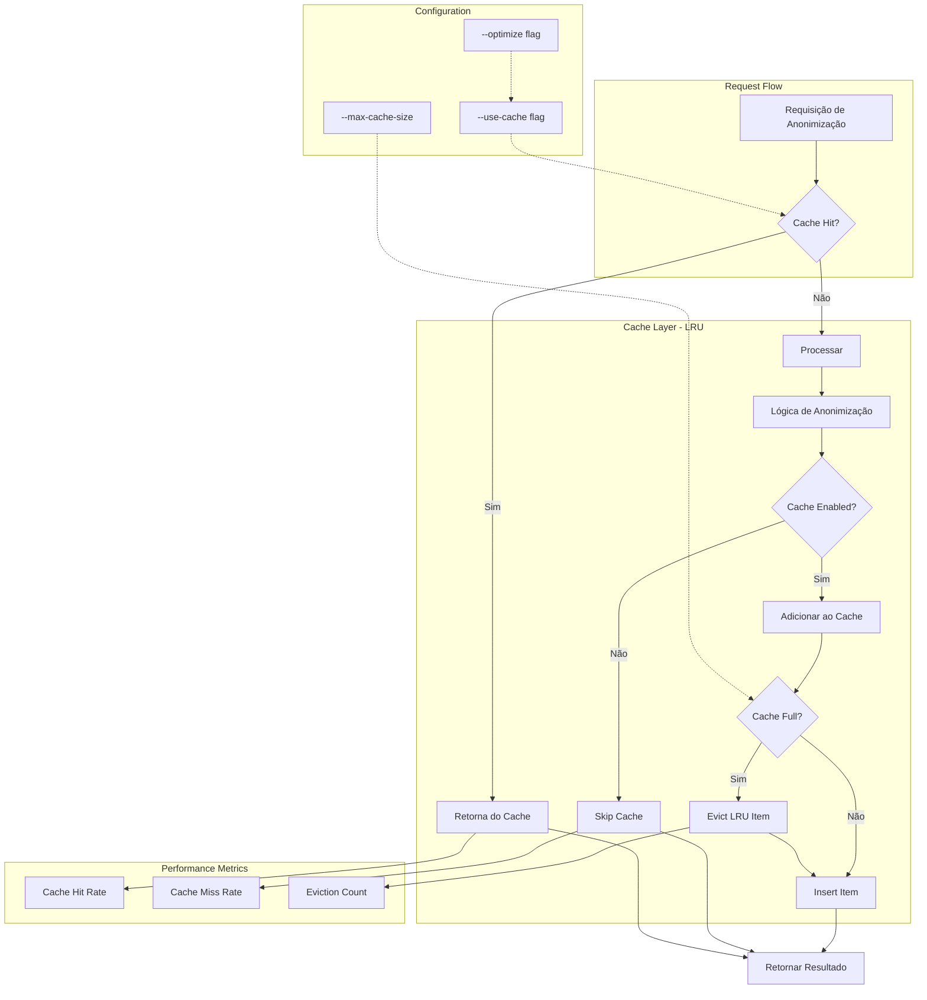
```mermaid
graph TD
    subgraph "Request Flow"
        Req[Requisição de Anonimização] --> CacheCheck{Cache Hit?}
    end
    
    subgraph "Cache Layer - LRU"
        CacheCheck -->|Sim| CacheHit[Retorna do Cache]
        CacheCheck -->|Não| Process[Processar]
        
        Process --> AnonymizeLogic[Lógica de Anonimização]
        AnonymizeLogic --> CacheAdd{Cache Enabled?}
        
        CacheAdd -->|Sim| AddToCache[Adicionar ao Cache]
        CacheAdd -->|Não| Skip[Skip Cache]
        
        AddToCache --> CheckSize{Cache Full?}
        CheckSize -->|Sim| Evict[Evict LRU Item]
        CheckSize -->|Não| Insert[Insert Item]
        
        Evict --> Insert
    end
    
    subgraph "Configuration"
        Config[--use-cache flag] -.-> CacheCheck
        MaxSize[--max-cache-size] -.-> CheckSize
        Optimize[--optimize flag] -.-> Config
    end
    
    subgraph "Performance Metrics"
        CacheHit --> Metrics1[Cache Hit Rate]
        Skip --> Metrics2[Cache Miss Rate]
        Evict --> Metrics3[Eviction Count]
    end
    
    Insert --> Return[Retornar Resultado]
    Skip --> Return
    CacheHit --> Return
    
```

## 5. **Fallback e Circuit Breaker Pattern**

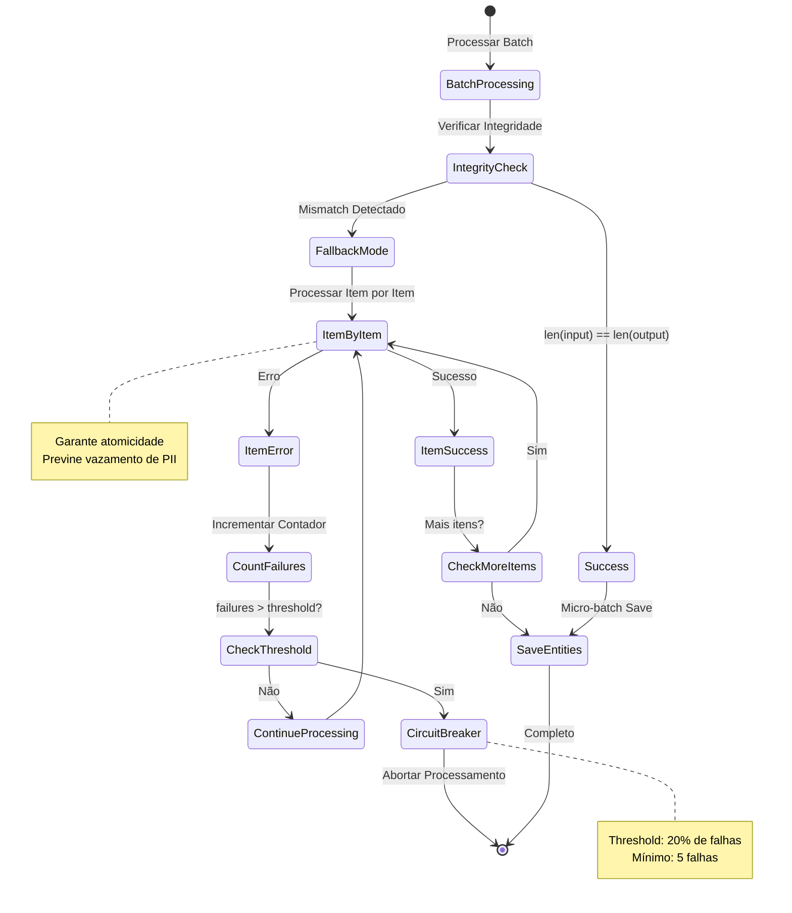
```mermaid
stateDiagram-v2
    [*] --> BatchProcessing: Processar Batch
    
    BatchProcessing --> IntegrityCheck: Verificar Integridade
    
    IntegrityCheck --> Success: len(input) == len(output)
    IntegrityCheck --> FallbackMode: Mismatch Detectado
    
    FallbackMode --> ItemByItem: Processar Item por Item
    
    ItemByItem --> ItemSuccess: Sucesso
    ItemByItem --> ItemError: Erro
    
    ItemError --> CountFailures: Incrementar Contador
    CountFailures --> CheckThreshold: failures > threshold?
    
    CheckThreshold --> ContinueProcessing: Não
    CheckThreshold --> CircuitBreaker: Sim
    
    ContinueProcessing --> ItemByItem
    ItemSuccess --> CheckMoreItems: Mais itens?
    
    CheckMoreItems --> ItemByItem: Sim
    CheckMoreItems --> SaveEntities: Não
    
    CircuitBreaker --> [*]: Abortar Processamento
    
    Success --> SaveEntities: Micro-batch Save
    SaveEntities --> [*]: Completo
    
    note right of CircuitBreaker
        Threshold: 20% de falhas
        Mínimo: 5 falhas
    end note
    
    note right of ItemByItem
        Garante atomicidade
        Previne vazamento de PII
    end note
```

## 6. **Arquitetura de Segurança (Security Architecture)**

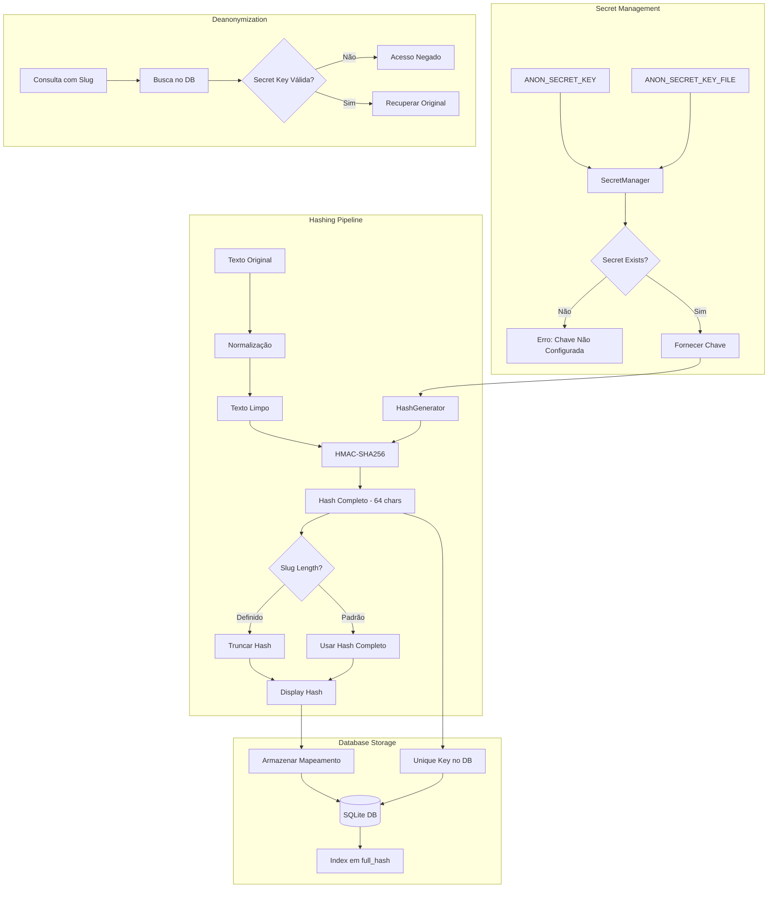
```mermaid
graph TB
    subgraph "Secret Management"
        EnvVar1[ANON_SECRET_KEY] --> SecMgr[SecretManager]
        EnvVar2[ANON_SECRET_KEY_FILE] --> SecMgr
        SecMgr --> Validate{Secret Exists?}
        Validate -->|Não| Error[Erro: Chave Não Configurada]
        Validate -->|Sim| Provide[Fornecer Chave]
    end
    
    subgraph "Hashing Pipeline"
        Provide --> HashGen[HashGenerator]
        Text[Texto Original] --> Normalize[Normalização]
        Normalize --> CleanText[Texto Limpo]
        
        CleanText & HashGen --> HMAC[HMAC-SHA256]
        HMAC --> FullHash[Hash Completo - 64 chars]
        
        FullHash --> Slug{Slug Length?}
        Slug -->|Definido| Truncate[Truncar Hash]
        Slug -->|Padrão| UseHull[Usar Hash Completo]
        
        Truncate --> DisplayHash[Display Hash]
        UseHull --> DisplayHash
    end
    
    subgraph "Database Storage"
        DisplayHash --> Store[Armazenar Mapeamento]
        FullHash --> UniqueKey[Unique Key no DB]
        
        Store --> DB[(SQLite DB)]
        UniqueKey --> DB
        
        DB --> Index[Index em full_hash]
    end
    
    subgraph "Deanonymization"
        Query[Consulta com Slug] --> Lookup[Busca no DB]
        Lookup --> RequireKey{Secret Key Válida?}
        RequireKey -->|Não| DenyAccess[Acesso Negado]
        RequireKey -->|Sim| RetrieveOriginal[Recuperar Original]
    end
    

```

## 7. **Processamento de Estruturas (JSON/XML Preservation)**

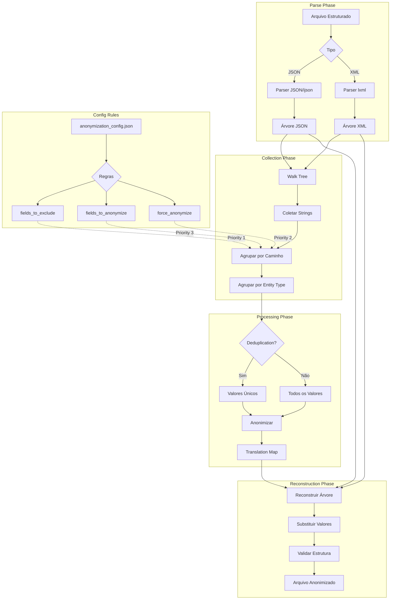
```mermaid
graph TD
    subgraph "Parse Phase"
        Input[Arquivo Estruturado] --> Parse{Tipo}
        Parse -->|JSON| ParseJSON[Parser JSON/ijson]
        Parse -->|XML| ParseXML[Parser lxml]
        
        ParseJSON --> Tree1[Árvore JSON]
        ParseXML --> Tree2[Árvore XML]
    end
    
    subgraph "Collection Phase"
        Tree1 & Tree2 --> Walk[Walk Tree]
        Walk --> CollectStrings[Coletar Strings]
        CollectStrings --> GroupByPath[Agrupar por Caminho]
        GroupByPath --> GroupByType[Agrupar por Entity Type]
    end
    
    subgraph "Config Rules"
        Config[anonymization_config.json] --> Rules{Regras}
        Rules --> Exclude[fields_to_exclude]
        Rules --> Include[fields_to_anonymize]
        Rules --> Force[force_anonymize]
        
        Exclude -.Priority 1.-> GroupByPath
        Force -.Priority 2.-> GroupByPath
        Include -.Priority 3.-> GroupByPath
    end
    
    subgraph "Processing Phase"
        GroupByType --> Dedup{Deduplication?}
        Dedup -->|Sim| UniqueVals[Valores Únicos]
        Dedup -->|Não| AllVals[Todos os Valores]
        
        UniqueVals --> Anonymize[Anonimizar]
        AllVals --> Anonymize
        
        Anonymize --> TransMap[Translation Map]
    end
    
    subgraph "Reconstruction Phase"
        TransMap --> Reconstruct[Reconstruir Árvore]
        Tree1 --> Reconstruct
        Tree2 --> Reconstruct
        
        Reconstruct --> Replace[Substituir Valores]
        Replace --> Validate[Validar Estrutura]
        Validate --> Output[Arquivo Anonimizado]
    end
    

```

## 8. **Diagrama de Componentes (Component Diagram - C4 Model)**

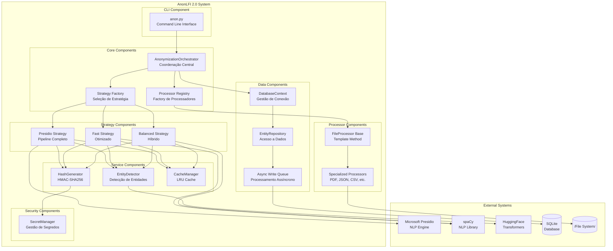
```mermaid
graph TB
    subgraph "AnonLFI 2.0 System"
        subgraph "CLI Component"
            CLI[anon.py<br/>Command Line Interface]
        end
        
        subgraph "Core Components"
            Orchestrator[AnonymizationOrchestrator<br/>Coordenação Central]
            StrategyFactory[Strategy Factory<br/>Seleção de Estratégia]
            ProcessorRegistry[Processor Registry<br/>Factory de Processadores]
        end
        
        subgraph "Strategy Components"
            Strategy1[Presidio Strategy<br/>Pipeline Completo]
            Strategy2[Fast Strategy<br/>Otimizado]
            Strategy3[Balanced Strategy<br/>Híbrido]
        end
        
        subgraph "Processor Components"
            Proc1[FileProcessor Base<br/>Template Method]
            Proc2[Specialized Processors<br/>PDF, JSON, CSV, etc.]
        end
        
        subgraph "Service Components"
            EntityDetector[EntityDetector<br/>Detecção de Entidades]
            HashGenerator[HashGenerator<br/>HMAC-SHA256]
            CacheManager[CacheManager<br/>LRU Cache]
        end
        
        subgraph "Data Components"
            DatabaseContext[DatabaseContext<br/>Gestão de Conexão]
            Repository[EntityRepository<br/>Acesso a Dados]
            AsyncQueue[Async Write Queue<br/>Processamento Assíncrono]
        end
        
        subgraph "Security Components"
            SecretManager[SecretManager<br/>Gestão de Segredos]
        end
    end
    
    subgraph "External Systems"
        Presidio[Microsoft Presidio<br/>NLP Engine]
        SpaCy[spaCy<br/>NLP Library]
        Transformers[HuggingFace<br/>Transformers]
        SQLite[(SQLite<br/>Database)]
        FileSystem[(/File System/)]
    end
    
    CLI --> Orchestrator
    Orchestrator --> StrategyFactory
    Orchestrator --> ProcessorRegistry
    
    StrategyFactory --> Strategy1
    StrategyFactory --> Strategy2
    StrategyFactory --> Strategy3
    
    ProcessorRegistry --> Proc1
    Proc1 --> Proc2
    
    Strategy1 & Strategy2 & Strategy3 --> EntityDetector
    Strategy1 & Strategy2 & Strategy3 --> HashGenerator
    Strategy1 & Strategy2 & Strategy3 --> CacheManager
    
    Orchestrator --> DatabaseContext
    DatabaseContext --> Repository
    Repository --> AsyncQueue
    AsyncQueue --> SQLite
    
    HashGenerator --> SecretManager
    
    Strategy1 --> Presidio
    Strategy2 & Strategy3 --> SpaCy
    EntityDetector --> Transformers
    
    Proc2 --> FileSystem
    
```

## 9. **Diagrama de Sequência: Fluxo de Anonimização Completo**

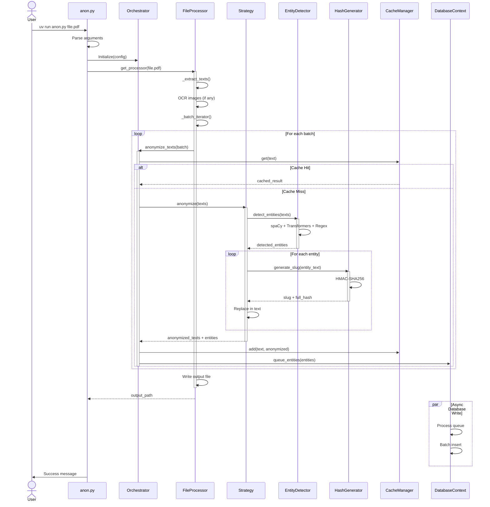
```mermaid
sequenceDiagram
    actor User
    participant CLI as anon.py
    participant Orch as Orchestrator
    participant Proc as FileProcessor
    participant Strat as Strategy
    participant EntityDet as EntityDetector
    participant Hash as HashGenerator
    participant Cache as CacheManager
    participant DB as DatabaseContext
    
    User->>CLI: uv run anon.py file.pdf
    CLI->>CLI: Parse arguments
    CLI->>Orch: Initialize(config)
    CLI->>Proc: get_processor(file.pdf)
    
    activate Proc
    Proc->>Proc: _extract_texts()
    Proc->>Proc: OCR images (if any)
    Proc->>Proc: _batch_iterator()
    
    loop For each batch
        Proc->>Orch: anonymize_texts(batch)
        activate Orch
        
        Orch->>Cache: get(text)
        alt Cache Hit
            Cache-->>Orch: cached_result
        else Cache Miss
            Orch->>Strat: anonymize(texts)
            activate Strat
            
            Strat->>EntityDet: detect_entities(texts)
            activate EntityDet
            EntityDet->>EntityDet: spaCy + Transformers + Regex
            EntityDet-->>Strat: detected_entities
            deactivate EntityDet
            
            loop For each entity
                Strat->>Hash: generate_slug(entity_text)
                activate Hash
                Hash->>Hash: HMAC-SHA256
                Hash-->>Strat: slug + full_hash
                deactivate Hash
                
                Strat->>Strat: Replace in text
            end
            
            Strat-->>Orch: anonymized_texts + entities
            deactivate Strat
            
            Orch->>Cache: add(text, anonymized)
            Orch->>DB: queue_entities(entities)
        end
        
        deactivate Orch
    end
    
    Proc->>Proc: Write output file
    deactivate Proc
    
    Proc-->>CLI: output_path
    
    par Async Database Write
        DB->>DB: Process queue
        DB->>DB: Batch insert
    end
    
    CLI->>User: Success message
```

## 10. **Diagrama de Decisão: Configuração Avançada (Advanced Config)**

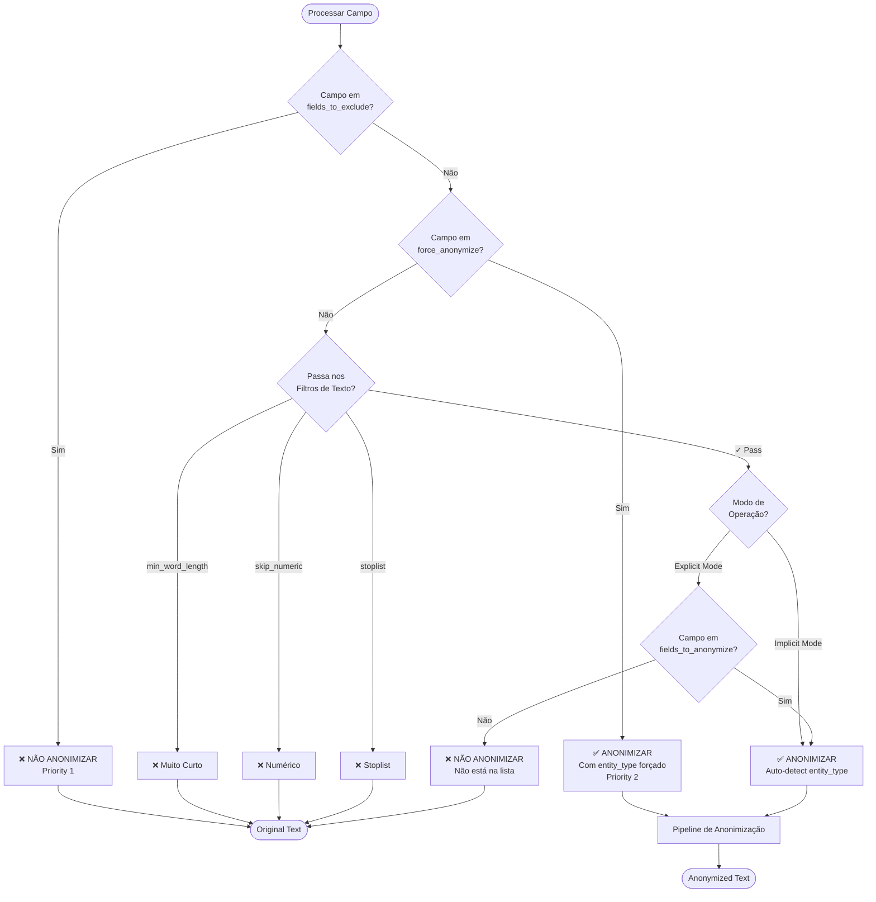
```mermaid
graph TD
    Start([Processar Campo]) --> CheckExclude{Campo em<br/>fields_to_exclude?}
    
    CheckExclude -->|Sim| Exclude[❌ NÃO ANONIMIZAR<br/>Priority 1]
    CheckExclude -->|Não| CheckForce{Campo em<br/>force_anonymize?}
    
    CheckForce -->|Sim| ForceAnon[✅ ANONIMIZAR<br/>Com entity_type forçado<br/>Priority 2]
    CheckForce -->|Não| CheckText{Passa nos<br/>Filtros de Texto?}
    
    CheckText -->|min_word_length| Reject1[❌ Muito Curto]
    CheckText -->|skip_numeric| Reject2[❌ Numérico]
    CheckText -->|stoplist| Reject3[❌ Stoplist]
    CheckText -->|✓ Pass| CheckMode{Modo de<br/>Operação?}
    
    CheckMode -->|Explicit Mode| CheckInclude{Campo em<br/>fields_to_anonymize?}
    CheckMode -->|Implicit Mode| AutoAnon[✅ ANONIMIZAR<br/>Auto-detect entity_type]
    
    CheckInclude -->|Sim| AutoAnon
    CheckInclude -->|Não| ImplicitSkip[❌ NÃO ANONIMIZAR<br/>Não está na lista]
    
    Exclude & Reject1 & Reject2 & Reject3 & ImplicitSkip --> End([Original Text])
    ForceAnon & AutoAnon --> AnonymizePipeline[Pipeline de Anonimização]
    AnonymizePipeline --> End2([Anonymized Text])
    
```

---

## Recomendações de Uso

1. **Para Documentação de Arquitetura**: Use os diagramas 1, 6, 8
2. **Para Onboarding de Desenvolvedores**: Use os diagramas 2, 3, 9
3. **Para Revisão de Código e Design**: Use os diagramas 4, 5, 7
4. **Para Documentação de Usuário**: Use o diagrama 10 (configuração)
5. **Para Apresentações Executivas**: Use uma versão simplificada do diagrama 1

Estes diagramas cobrem os aspectos críticos da arquitetura e podem ser facilmente mantidos em Markdown usando Mermaid, facilitando a documentação viva no repositório.

# Diagramas de Classes e Diagramas Simplificados para Artigo

## Parte 1: Diagramas de Classes Detalhados

### 1. **Diagrama de Classes: Core Domain Model**

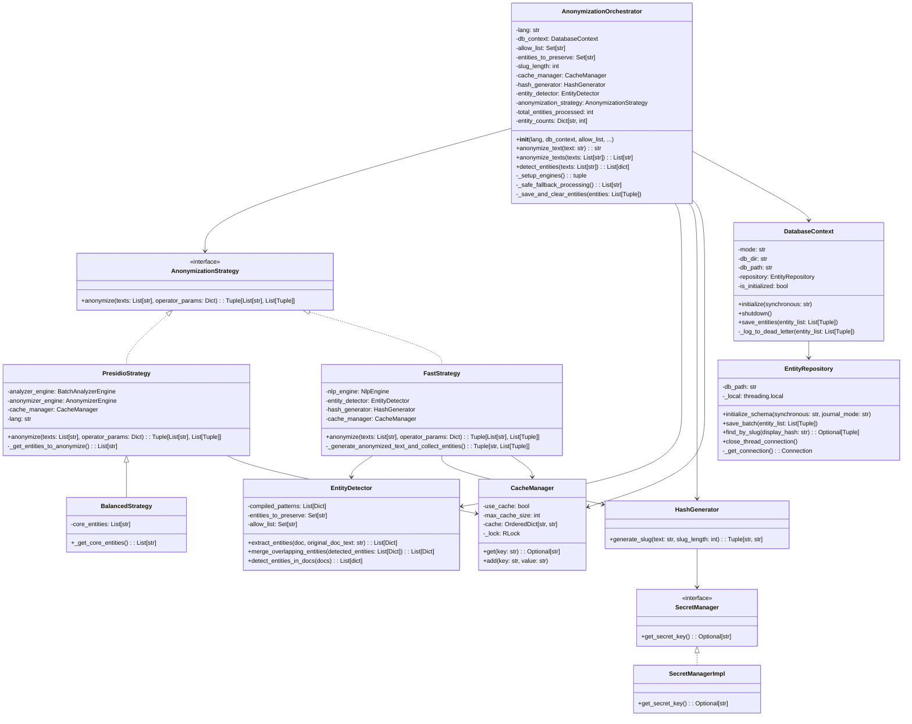
```mermaid
classDiagram
    class AnonymizationOrchestrator {
        -lang: str
        -db_context: DatabaseContext
        -allow_list: Set[str]
        -entities_to_preserve: Set[str]
        -slug_length: int
        -cache_manager: CacheManager
        -hash_generator: HashGenerator
        -entity_detector: EntityDetector
        -anonymization_strategy: AnonymizationStrategy
        -total_entities_processed: int
        -entity_counts: Dict[str, int]
        +__init__(lang, db_context, allow_list, ...)
        +anonymize_text(text: str): str
        +anonymize_texts(texts: List[str]): List[str]
        +detect_entities(texts: List[str]): List[dict]
        -_setup_engines(): tuple
        -_safe_fallback_processing(): List[str]
        -_save_and_clear_entities(entities: List[Tuple])
    }

    class AnonymizationStrategy {
        <<interface>>
        +anonymize(texts: List[str], operator_params: Dict): Tuple[List[str], List[Tuple]]
    }

    class PresidioStrategy {
        -analyzer_engine: BatchAnalyzerEngine
        -anonymizer_engine: AnonymizerEngine
        -cache_manager: CacheManager
        -lang: str
        +anonymize(texts: List[str], operator_params: Dict): Tuple[List[str], List[Tuple]]
        -_get_entities_to_anonymize(): List[str]
    }

    class FastStrategy {
        -nlp_engine: NlpEngine
        -entity_detector: EntityDetector
        -hash_generator: HashGenerator
        -cache_manager: CacheManager
        +anonymize(texts: List[str], operator_params: Dict): Tuple[List[str], List[Tuple]]
        -_generate_anonymized_text_and_collect_entities(): Tuple[str, List[Tuple]]
    }

    class BalancedStrategy {
        -core_entities: List[str]
        +_get_core_entities(): List[str]
    }

    class EntityDetector {
        -compiled_patterns: List[Dict]
        -entities_to_preserve: Set[str]
        -allow_list: Set[str]
        +extract_entities(doc, original_doc_text: str): List[Dict]
        +merge_overlapping_entities(detected_entities: List[Dict]): List[Dict]
        +detect_entities_in_docs(docs): List[dict]
    }

    class HashGenerator {
        +generate_slug(text: str, slug_length: int): Tuple[str, str]
    }

    class CacheManager {
        -use_cache: bool
        -max_cache_size: int
        -cache: OrderedDict[str, str]
        -_lock: RLock
        +get(key: str): Optional[str]
        +add(key: str, value: str)
    }

    class DatabaseContext {
        -mode: str
        -db_dir: str
        -db_path: str
        -repository: EntityRepository
        -is_initialized: bool
        +initialize(synchronous: str)
        +shutdown()
        +save_entities(entity_list: List[Tuple])
        -_log_to_dead_letter(entity_list: List[Tuple])
    }

    class EntityRepository {
        -db_path: str
        -_local: threading.local
        +initialize_schema(synchronous: str, journal_mode: str)
        +save_batch(entity_list: List[Tuple])
        +find_by_slug(display_hash: str): Optional[Tuple]
        +close_thread_connection()
        -_get_connection(): Connection
    }

    class SecretManager {
        <<interface>>
        +get_secret_key(): Optional[str]
    }

    class SecretManagerImpl {
        +get_secret_key(): Optional[str]
    }

    AnonymizationOrchestrator --> AnonymizationStrategy
    AnonymizationOrchestrator --> EntityDetector
    AnonymizationOrchestrator --> HashGenerator
    AnonymizationOrchestrator --> CacheManager
    AnonymizationOrchestrator --> DatabaseContext
    
    AnonymizationStrategy <|.. PresidioStrategy
    AnonymizationStrategy <|.. FastStrategy
    PresidioStrategy <|-- BalancedStrategy
    
    DatabaseContext --> EntityRepository
    HashGenerator --> SecretManager
    SecretManager <|.. SecretManagerImpl
    
    PresidioStrategy --> CacheManager
    FastStrategy --> EntityDetector
    FastStrategy --> HashGenerator
    FastStrategy --> CacheManager
```

### 2. **Diagrama de Classes: File Processors Hierarchy**

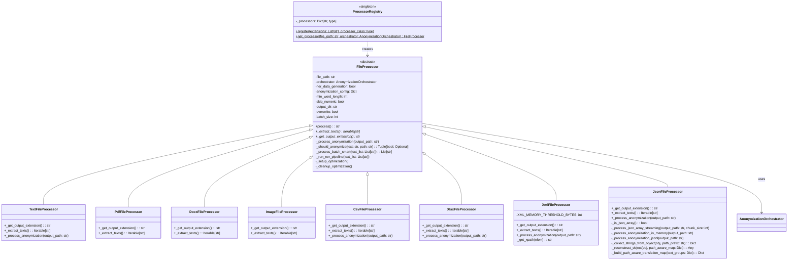
```mermaid
classDiagram
    class FileProcessor {
        <<abstract>>
        -file_path: str
        -orchestrator: AnonymizationOrchestrator
        -ner_data_generation: bool
        -anonymization_config: Dict
        -min_word_length: int
        -skip_numeric: bool
        -output_dir: str
        -overwrite: bool
        -batch_size: int
        +process(): str
        +_extract_texts()* Iterable[str]
        +_get_output_extension()* str
        -_process_anonymization(output_path: str)
        -_should_anonymize(text: str, path: str): Tuple[bool, Optional]
        -_process_batch_smart(text_list: List[str]): List[str]
        -_run_ner_pipeline(text_list: List[str])
        -_setup_optimization()
        -_cleanup_optimization()
    }

    class TextFileProcessor {
        +_get_output_extension(): str
        +_extract_texts(): Iterable[str]
        +_process_anonymization(output_path: str)
    }

    class PdfFileProcessor {
        +_get_output_extension(): str
        +_extract_texts(): Iterable[str]
    }

    class DocxFileProcessor {
        +_get_output_extension(): str
        +_extract_texts(): Iterable[str]
    }

    class ImageFileProcessor {
        +_get_output_extension(): str
        +_extract_texts(): Iterable[str]
    }

    class CsvFileProcessor {
        +_get_output_extension(): str
        +_extract_texts(): Iterable[str]
        +_process_anonymization(output_path: str)
    }

    class XlsxFileProcessor {
        +_get_output_extension(): str
        +_extract_texts(): Iterable[str]
        +_process_anonymization(output_path: str)
    }

    class XmlFileProcessor {
        -XML_MEMORY_THRESHOLD_BYTES: int
        +_get_output_extension(): str
        +_extract_texts(): Iterable[str]
        +_process_anonymization(output_path: str)
        -_get_xpath(elem): str
    }

    class JsonFileProcessor {
        +_get_output_extension(): str
        +_extract_texts(): Iterable[str]
        +_process_anonymization(output_path: str)
        -_is_json_array(): bool
        -_process_json_array_streaming(output_path: str, chunk_size: int)
        -_process_anonymization_in_memory(output_path: str)
        -_process_anonymization_jsonl(output_path: str)
        -_collect_strings_from_object(obj, path_prefix: str): Dict
        -_reconstruct_object(obj, path_aware_map: Dict): Any
        -_build_path_aware_translation_map(text_groups: Dict): Dict
    }

    class ProcessorRegistry {
        <<singleton>>
        -_processors: Dict[str, type]
        +register(extensions: List[str], processor_class: type)$
        +get_processor(file_path: str, orchestrator: AnonymizationOrchestrator)$ FileProcessor
    }

    FileProcessor <|-- TextFileProcessor
    FileProcessor <|-- PdfFileProcessor
    FileProcessor <|-- DocxFileProcessor
    FileProcessor <|-- ImageFileProcessor
    FileProcessor <|-- CsvFileProcessor
    FileProcessor <|-- XlsxFileProcessor
    FileProcessor <|-- XmlFileProcessor
    FileProcessor <|-- JsonFileProcessor
    
    ProcessorRegistry ..> FileProcessor : creates
    FileProcessor --> AnonymizationOrchestrator : uses
```

### 3. **Diagrama de Classes: Protocols (Dependency Inversion)**

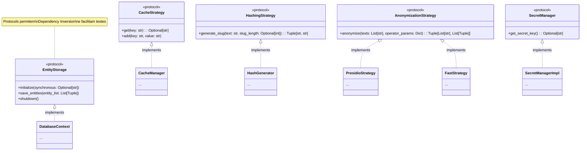
```mermaid
classDiagram
    class EntityStorage {
        <<protocol>>
        +initialize(synchronous: Optional[str])
        +save_entities(entity_list: List[Tuple])
        +shutdown()
    }

    class CacheStrategy {
        <<protocol>>
        +get(key: str): Optional[str]
        +add(key: str, value: str)
    }

    class HashingStrategy {
        <<protocol>>
        +generate_slug(text: str, slug_length: Optional[int]): Tuple[str, str]
    }

    class AnonymizationStrategy {
        <<protocol>>
        +anonymize(texts: List[str], operator_params: Dict): Tuple[List[str], List[Tuple]]
    }

    class SecretManager {
        <<protocol>>
        +get_secret_key(): Optional[str]
    }

    class DatabaseContext {
        ...
    }

    class CacheManager {
        ...
    }

    class HashGenerator {
        ...
    }

    class PresidioStrategy {
        ...
    }

    class FastStrategy {
        ...
    }

    class SecretManagerImpl {
        ...
    }

    EntityStorage <|.. DatabaseContext : implements
    CacheStrategy <|.. CacheManager : implements
    HashingStrategy <|.. HashGenerator : implements
    AnonymizationStrategy <|.. PresidioStrategy : implements
    AnonymizationStrategy <|.. FastStrategy : implements
    SecretManager <|.. SecretManagerImpl : implements

    note for EntityStorage "Protocols permitem\nDependency Inversion\ne facilitam testes"
```

---

## Parte 2: Diagramas Simplificados para Artigo

### 4. **Diagrama Simplificado: Visão Geral da Arquitetura (Para Artigo)**

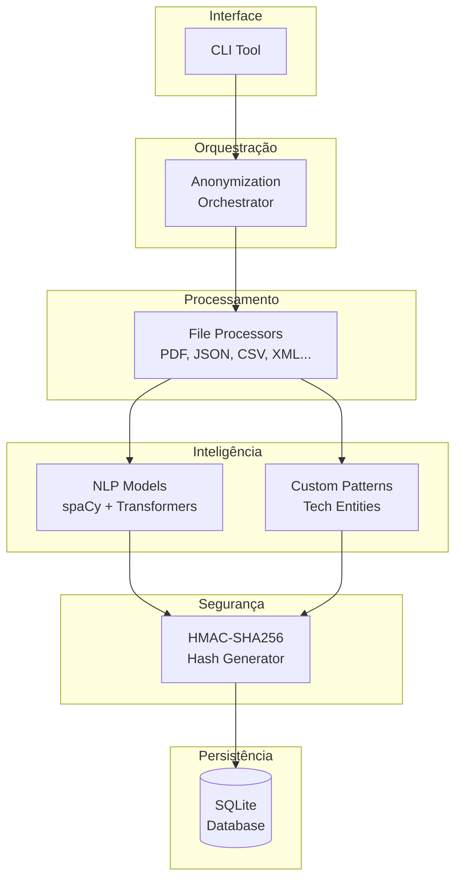
```mermaid
graph TB
    subgraph "Interface"
        CLI[CLI Tool]
    end
    
    subgraph "Orquestração"
        Engine[Anonymization<br/>Orchestrator]
    end
    
    subgraph "Processamento"
        Processors[File Processors<br/>PDF, JSON, CSV, XML...]
    end
    
    subgraph "Inteligência"
        NLP[NLP Models<br/>spaCy + Transformers]
        Regex[Custom Patterns<br/>Tech Entities]
    end
    
    subgraph "Segurança"
        Hash[HMAC-SHA256<br/>Hash Generator]
    end
    
    subgraph "Persistência"
        DB[(SQLite<br/>Database)]
    end
    
    CLI --> Engine
    Engine --> Processors
    Processors --> NLP
    Processors --> Regex
    NLP --> Hash
    Regex --> Hash
    Hash --> DB
    
```

### 5. **Diagrama Simplificado: Fluxo de Anonimização (Para Artigo)**

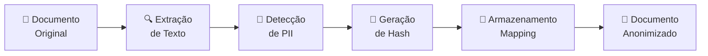
```mermaid
graph LR
    A[📄 Documento<br/>Original] --> B[🔍 Extração<br/>de Texto]
    B --> C[🤖 Detecção<br/>de PII]
    C --> D[🔐 Geração<br/>de Hash]
    D --> E[💾 Armazenamento<br/>Mapping]
    E --> F[📝 Documento<br/>Anonimizado]
    
```

### 6. **Diagrama Simplificado: Tipos de Entidades Detectadas (Para Artigo)**

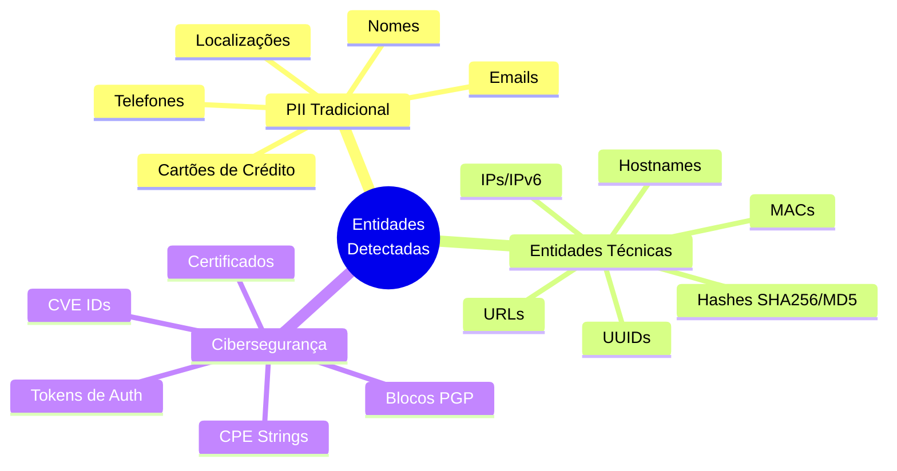
```mermaid
mindmap
  root((Entidades<br/>Detectadas))
    PII Tradicional
      Nomes
      Emails
      Telefones
      Cartões de Crédito
      Localizações
    Entidades Técnicas
      IPs/IPv6
      URLs
      Hostnames
      Hashes SHA256/MD5
      UUIDs
      MACs
    Cibersegurança
      CVE IDs
      CPE Strings
      Certificados
      Tokens de Auth
      Blocos PGP
```

### 7. **Diagrama Simplificado: Estratégias de Performance (Para Artigo)**

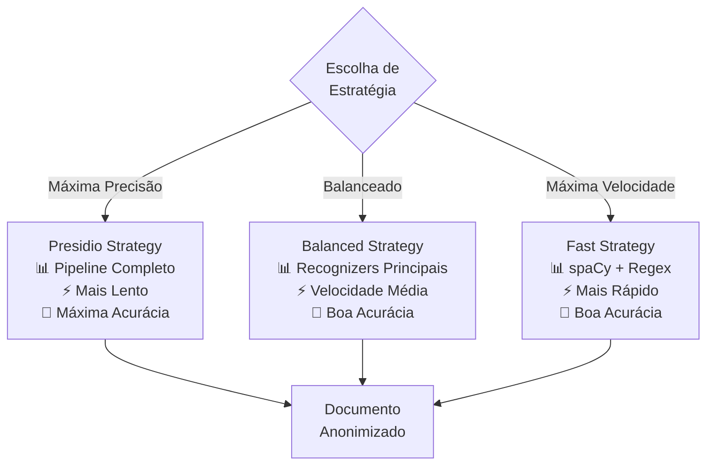
```mermaid
graph TD
    Start{Escolha de<br/>Estratégia}
    
    Start -->|Máxima Precisão| Presidio[Presidio Strategy<br/>📊 Pipeline Completo<br/>⚡ Mais Lento<br/>🎯 Máxima Acurácia]
    
    Start -->|Balanceado| Balanced[Balanced Strategy<br/>📊 Recognizers Principais<br/>⚡ Velocidade Média<br/>🎯 Boa Acurácia]
    
    Start -->|Máxima Velocidade| Fast[Fast Strategy<br/>📊 spaCy + Regex<br/>⚡ Mais Rápido<br/>🎯 Boa Acurácia]
    
    Presidio --> Result[Documento<br/>Anonimizado]
    Balanced --> Result
    Fast --> Result

```

### 8. **Diagrama Simplificado: Garantias de Segurança (Para Artigo)**

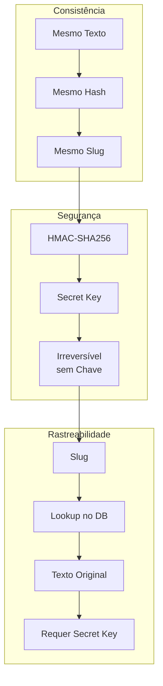
```mermaid
graph TD
    subgraph "Consistência"
        A[Mesmo Texto] --> B[Mesmo Hash]
        B --> C[Mesmo Slug]
    end
    
    subgraph "Segurança"
        D[HMAC-SHA256] --> E[Secret Key]
        E --> F[Irreversível<br/>sem Chave]
    end
    
    subgraph "Rastreabilidade"
        G[Slug] --> H[Lookup no DB]
        H --> I[Texto Original]
        I --> J[Requer Secret Key]
    end
    
    C --> D
    F --> G
    
```

### 9. **Diagrama Simplificado: Suporte Multi-formato (Para Artigo)**

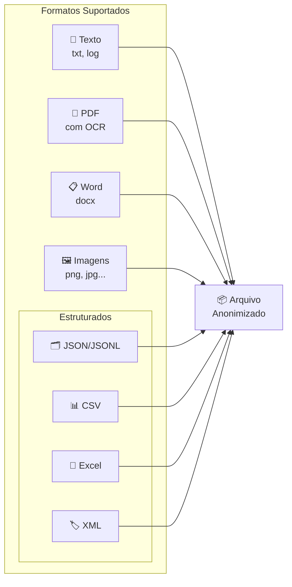
```mermaid
graph LR
    subgraph "Formatos Suportados"
        direction TB
        T[📝 Texto<br/>txt, log]
        P[📄 PDF<br/>com OCR]
        D[📋 Word<br/>docx]
        I[🖼️ Imagens<br/>png, jpg...]
        
        subgraph "Estruturados"
            J[🗂️ JSON/JSONL]
            C[📊 CSV]
            X[📑 Excel]
            M[🏷️ XML]
        end
    end
    
    T & P & D & I & J & C & X & M --> Output[📦 Arquivo<br/>Anonimizado]

```

### 10. **Diagrama Simplificado: Arquitetura de 3 Camadas (Para Artigo)**

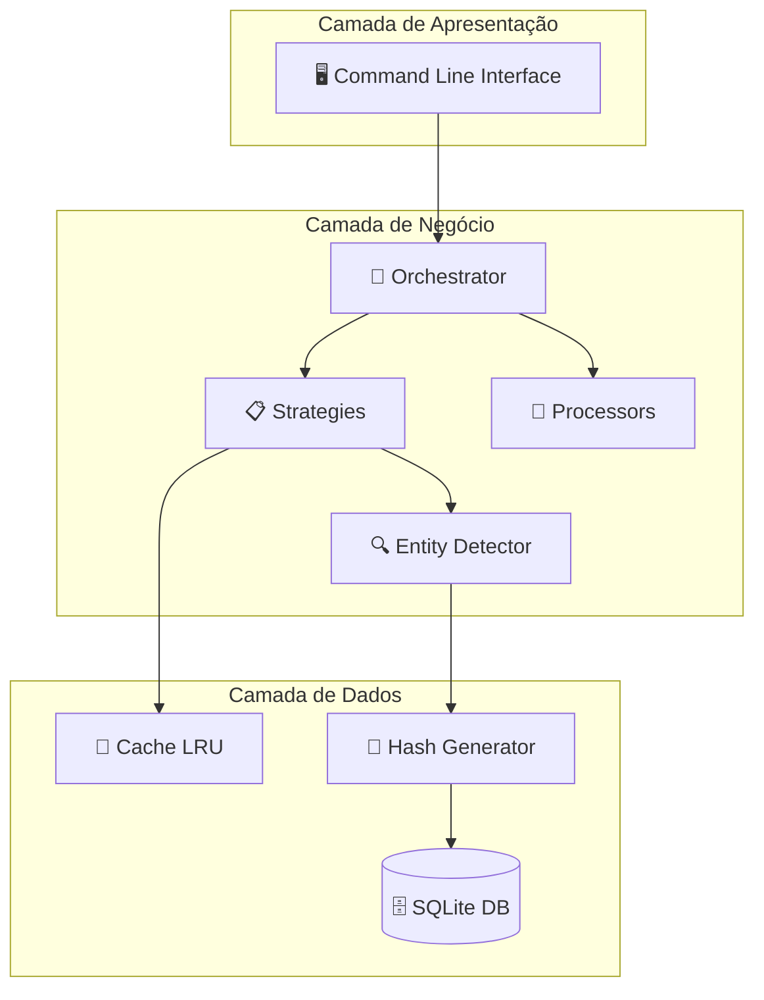
```mermaid
graph TB
    subgraph "Camada de Apresentação"
        CLI[🖥️ Command Line Interface]
    end
    
    subgraph "Camada de Negócio"
        Orch[🎯 Orchestrator]
        Strat[📋 Strategies]
        Proc[📁 Processors]
        Det[🔍 Entity Detector]
    end
    
    subgraph "Camada de Dados"
        Cache[💾 Cache LRU]
        DB[(🗄️ SQLite DB)]
        Hash[🔐 Hash Generator]
    end
    
    CLI --> Orch
    Orch --> Strat
    Orch --> Proc
    Strat --> Det
    Det --> Hash
    Hash --> DB
    Strat --> Cache

```

### 11. **Diagrama de Estado: Ciclo de Vida de uma Entidade (Para Artigo)**

```mermaid
stateDiagram-v2
    [*] --> Detected: Texto Detectado
    
    Detected --> Validated: Passa Filtros
    Detected --> Ignored: Falha nos Filtros
    
    Validated --> Cached: Já Anonimizado
    Validated --> Processing: Primeira Vez
    
    Processing --> Hashing: HMAC-SHA256
    Hashing --> Stored: Salvo no DB
    Stored --> Replaced: Substituído no Texto
    
    Cached --> Replaced
    Replaced --> [*]
    Ignored --> [*]
    
    note right of Hashing
        Secret Key
        + Text
        = Unique Hash
    end note
```

### 12. **Diagrama Simplificado: Pipeline OCR (Para Artigo)**

```mermaid
graph LR
    A[📄 PDF/DOCX] --> B{Contém<br/>Imagens?}
    B -->|Não| C[📝 Texto<br/>Direto]
    B -->|Sim| D[🖼️ Extração<br/>de Imagens]
    D --> E[👁️ Tesseract<br/>OCR]
    E --> F[📝 Texto<br/>da Imagem]
    C --> G[📦 Texto<br/>Consolidado]
    F --> G
    G --> H[🔍 Detecção<br/>de PII]
    H --> I[📝 Documento<br/>Anonimizado]

```

### 13. **Diagrama de Classes Simplificado: Padrões de Design (Para Artigo)**

```mermaid
classDiagram
    class Strategy Pattern {
        <<pattern>>
        AnonymizationStrategy
        PresidioStrategy
        FastStrategy
        BalancedStrategy
    }
    
    class Template Method {
        <<pattern>>
        FileProcessor
        PDFProcessor
        JSONProcessor
        CSVProcessor
    }
    
    class Factory {
        <<pattern>>
        ProcessorRegistry
        StrategyFactory
    }
    
    class Repository {
        <<pattern>>
        EntityRepository
        DatabaseContext
    }
    
    class Singleton {
        <<pattern>>
        ProcessorRegistry
    }
    
    note for Strategy Pattern "Permite trocar\nalgorítmos em\ntempo de execução"
    
    note for Template Method "Define skeleton\ndo algoritmo,\nsubclasses implementam\ndetalhes"
```

### 14. **Métricas de Performance (Para Artigo) - Diagrama Visual**

```mermaid
graph TB
    subgraph "Otimizações Disponíveis"
        O1[🚀 Cache LRU<br/>~3x mais rápido]
        O2[⚡ Fast Strategy<br/>~2x mais rápido]
        O3[💾 In-Memory DB<br/>~1.5x mais rápido]
        O4[📦 Batch Processing<br/>~4x mais rápido]
    end
    
    subgraph "Resultados"
        R[📊 Até 10x de<br/>melhoria combinada]
    end
    
    O1 & O2 & O3 & O4 --> R
```

---

## Recomendações para Uso em Artigo

### Para o Artigo Científico, recomendo incluir:

**Obrigatórios:**
1. **Diagrama 4** (Visão Geral) - Na introdução/metodologia
2. **Diagrama 5** (Fluxo de Anonimização) - Na seção de metodologia
3. **Diagrama 8** (Garantias de Segurança) - Na seção de segurança
4. **Diagrama 12** (Pipeline OCR) - Se for destacar a contribuição do OCR

**Opcionais (dependendo do foco):**
5. **Diagrama 6** (Mind Map de Entidades) - Para mostrar abrangência
6. **Diagrama 7** (Estratégias) - Se discutir performance
7. **Diagrama 10** (3 Camadas) - Para explicar arquitetura
8. **Diagrama 13** (Padrões) - Se artigo tiver foco em engenharia de software

### Para Documentação Técnica Completa:
- Use **todos os diagramas de classes** (1, 2, 3)
- Adicione os diagramas de sequência e estado
- Mantenha os diagramas complexos para referência de desenvolvedores

### Dica de Apresentação:
- Diagramas 4-14 são **"publication-ready"** - simples, claros, com boa estética
- Use cores consistentes para destacar conceitos (segurança = vermelho, dados = verde, etc.)
- Todos estão em Mermaid, fácil de versionar e manter
