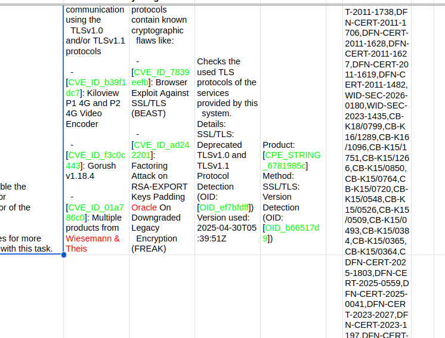
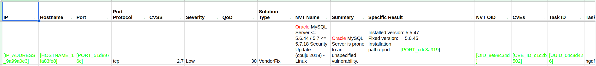
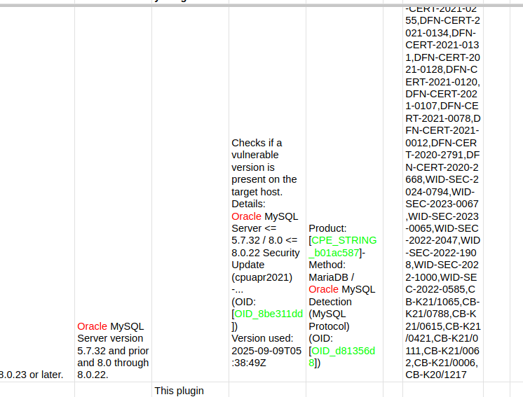
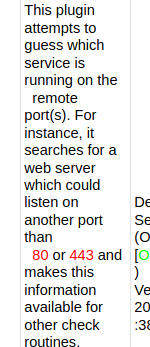
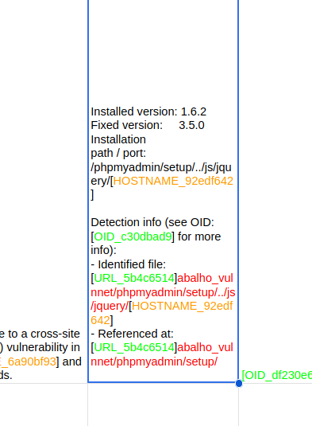
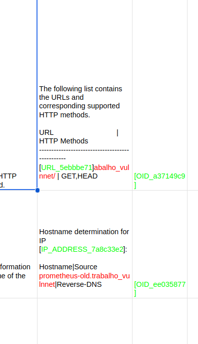
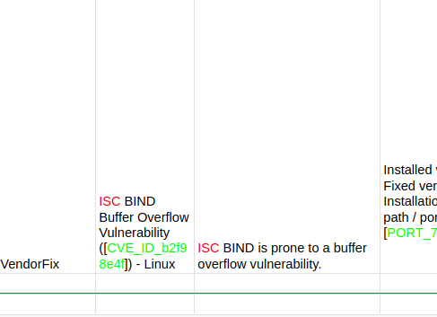
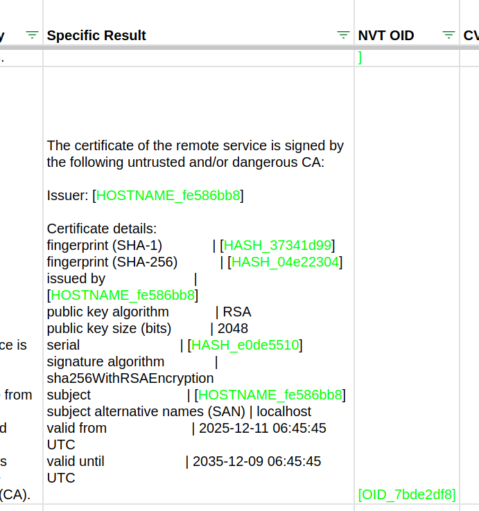

# Annotation Manual — AnonShield Accuracy Evaluation

This document records the annotation methodology adopted by the three security specialists who evaluated the 67 sampled records from the D1 OpenVAS dataset, as described in Section 4 of the paper. The goal is to document the criteria used, the ambiguous cases encountered, and the decisions made during the process — allowing the evaluation to be understood and replicated.

---

## Visual Annotation Examples

### Overview — multiple annotated rows



General view of the annotated spreadsheet showing multiple records. Green cells are TPs, red/orange are FNs or FPs.

---

### Annotated row — TP, FP, and correct entities (Oracle as FP)



A typical annotated row. In green (TP): `IP_ADDRESS`, `HOSTNAME`, `PORT`, `OID`, `CVE_ID`, and `UUID` — all correctly detected and pseudonymized. In orange (FP): "Oracle" in the *NVT Name* and *Summary* fields — it appears as part of a publicly known product name ("Oracle MySQL Server") and the CVE title. The annotators did not consider it an organizational entity identifying the target and registered it as FP.



Closer view showing the same FP pattern across multiple rows: "Oracle MySQL" highlighted in orange wherever it appears in vulnerability titles and descriptions.

---

### FN — PORT not anonymized



The text "80 or 443" (in red) remained exposed in the *Summary* field — the system did not detect those port numbers in this prose context. Registered as FN.

---

### Partial URL — filtered / hybrid / presidio



In the *Specific Result* field, the domain portion of the URL was replaced by `[URL_5b4c6514]` (green / TP) but the path `abalho_vulnnet/phpmyadmin/setup/...` remained exposed (orange / FN). The `HOSTNAME` inside the path (`[HOSTNAME_92edf642]`) was correctly anonymized. Applied rule: 1 TP + 1 FN per partially anonymized URL.

---

### FN — partial URL and hostname in free text



Two cases visible in the same record:

1. **Partial URL** — `[URL_5ebbbe71]abalho_vulnnet/` in the HTTP methods table: domain pseudonymized (TP), path `abalho_vulnnet` exposed (FN).
2. **Hostname in free text** — `prometheus-old.trabalho_vulnnet` in the *Hostname determination* block remained fully exposed in all versions (FN). The IP (`[IP_ADDRESS_7a8c33e2]`) was correctly anonymized (TP).

---

### FN — ISC BIND organization in technical prose



"ISC BIND" in the *NVT Name* and *Summary* fields remained exposed (red / FN) in v3.0 (SecureModernBERT). The `CVE_ID` in the same field was correctly anonymized (green / TP). The `PORT` in *Specific Result* was also correctly anonymized (TP). The 5 FNs recorded for the Presidio strategy in v3.0 were predominantly from this pattern.

---

### TLS Certificate — fingerprints correctly anonymized (filtered / hybrid / presidio)



The *Specific Result* field shows the expected behavior for TLS fingerprints in the filtered, hybrid, and presidio strategies: each complete fingerprint (SHA-1, SHA-256, serial) is treated as a single `HASH` entity, generating one pseudonym per fingerprint. Issuer, subject, and repeated subject are treated as `HOSTNAME`. Dates (`valid from`, `valid until`), algorithms, and key size remain exposed — not counted as FN since they are not part of the entity types evaluated in this study.

---

## 1. Entity Types Evaluated

This evaluation considered the 13 categories below as entities of interest in the context of OpenVAS reports. Other types of data may be sensitive in other contexts — the list reflects the scope of this study, not a universal definition of sensitivity.

| Type              | Description / examples                                                      |
|-------------------|-----------------------------------------------------------------------------|
| `IP_ADDRESS`      | IPv4 and IPv6 addresses                                                     |
| `HOSTNAME`        | Hostnames, FQDNs, subdomains                                                |
| `PORT`            | Network port numbers (e.g., `443`, `8080`)                                  |
| `UUID`            | Unique identifiers in UUID/GUID format                                      |
| `HASH`            | Cryptographic hashes (MD5, SHA-1, SHA-256, TLS fingerprints)                |
| `OID`             | Object Identifiers (e.g., X.509 certificate OIDs, SNMP)                    |
| `EMAIL_ADDRESS`   | Email addresses                                                             |
| `ORGANIZATION`    | Identifiable organization/company names                                     |
| `URL`             | Complete or partial URLs                                                    |
| `CVE_ID`          | CVE identifiers (e.g., `CVE-2021-44228`)                                    |
| `CPE_STRING`      | Common Platform Enumeration strings (e.g., `cpe:/a:apache:log4j:2.14.1`)   |
| `CERT_SERIAL`     | TLS/X.509 certificate serial numbers                                        |
| `AUTH_TOKEN`      | Authentication tokens, API keys, credentials                                |

Data such as dates, times, software versions, severity levels (e.g., "medium", "high"), cryptographic algorithm names, and descriptive CVE titles were not included in the scope of this evaluation. When the system anonymized them, the annotators registered them as FP — not because those values are harmless, but because they fell outside the defined scope.

---

## 2. TP, FP, and FN Definitions Adopted

### True Positive (TP)
The annotators registered 1 TP when an entity of one of the 13 types was detected and pseudonymized with the correct type.

- The value was replaced by a pseudonym (e.g., `[IP_ADDRESS_x]`, `[HOSTNAME_y]`).
- The pseudonym type matches the real entity type.

### False Positive (FP)
The annotators registered FP in two cases:

1. **Data outside the evaluation scope anonymized:** the system replaced a value that does not belong to the 13 evaluated types. Observed cases:
   - Severity field `medium` anonymized as `ORGANIZATION` (frequent in v2.0).
   - TCP timestamps (`Packet 1`) anonymized as `UK_NHS` by Presidio.
   - `localhost` anonymized (reserved hostname with no identifying value in context).
   - Vendor name in a product title ("Oracle" in "Oracle MySQL Server <= 5.6.44...") anonymized as `ORGANIZATION` — the annotators understood that, in the context of a public CVE title, the name does not identify the target asset.

2. **Wrong type:** the entity belongs to the scope but was anonymized with the wrong type (e.g., a `HOSTNAME` anonymized as `ORGANIZATION`). In this case the annotators registered **1 FP** — the entity was substituted and therefore did not leak, so there is no FN.

### False Negative (FN)
The annotators registered 1 FN for each in-scope entity that remained exposed in the output (not anonymized).

> The annotators adopted the following convention: a single exposed occurrence of an entity is sufficient to register 1 FN, regardless of how many other occurrences of the same entity were correctly anonymized in the same record. An observed example: "ISC" was correctly anonymized in 9 fields of the same vulnerability but remained exposed in 1 field — the annotators registered 1 FN. The rationale is that any leak, even isolated, compromises the protection of the entity.

---

## 3. Partial Anonymization

When only part of an entity was anonymized (the remainder stayed exposed), the annotators registered:

- **1 TP** for the correctly anonymized part.
- **1 FN** for the exposed remainder.

**Observed cases:**

| Output                                                                                 | Count adopted   |
|----------------------------------------------------------------------------------------|-----------------|
| `-[CVE_ID_3fc965e4]VE-2014-3597` (prefix replaced, suffix exposed)                    | 1 TP + 1 FN     |
| `[URL_5b4c6514]abalho_vulnnet/phpmyadmin/...` (domain anonymized, path exposed)       | 1 TP + 1 FN     |
| `[IP_ADDRESS_x].1.72` (initial octets anonymized, final octets exposed)               | 1 TP + 1 FN     |
| `prometheus-old.[HOSTNAME_x]_[HOSTNAME_y]nnet` (hostname fragmented, parts exposed)   | 1 TP + 1 FN     |

---

## 4. Duplicated and Fragmented Entities

### 4.1 Counting basis: actual occurrences in the original text

The annotators based their count on the number of **actual occurrences of the entity in the original text** — not on the number of pseudonyms generated in the output. If the entity appeared 10 times in the original and all were correctly anonymized, **10 TP** are counted.

The specific problem with **standalone** is that it can generate more pseudonyms than there are real occurrences — artificially inflating the count. In those cases the annotators counted based on the original, not the inflated output.

**Observed cases:**

| Situation                                                                                            | Count adopted                       |
|------------------------------------------------------------------------------------------------------|-------------------------------------|
| CVE-2021-44228 appears 3× in the original, 3 pseudonyms in the output, all correct                  | **3 TP**                            |
| CVE-2021-44228 appears 3× in the original, standalone generated 6 pseudonyms (inflated)             | **3 TP** (based on the original)    |
| CVE-2021-44228 and CVE-2019-0708 both anonymized (1 occurrence each)                                | **2 TP**                            |
| `[ORGANIZATION_x][ORGANIZATION_y]` for a single name in the original (standalone fragmented)        | **1 TP**                            |
| IP 10.0.0.1 appears 3× in the original, all anonymized                                              | **3 TP**                            |
| IP 10.0.0.1 and 192.168.1.5 both anonymized (1 occurrence each)                                     | **2 TP**                            |

### 4.2 Multiple CVEs merged into a single pseudonym (filtered / hybrid / presidio)

In the filtered, hybrid, and presidio strategies, Presidio's entity merging occasionally collapsed multiple comma-separated CVE IDs in the same field into a single pseudonym. Observed example from the CVEs column:

```
Original : CVE-2016-5770,CVE-2016-5771
Anonymized: [CVE_ID_a035b8b5]
```

The annotators registered **1 TP** for this case. Both CVEs were effectively hidden (none leaked), and the field was pseudonymized with the correct type. The merge was treated as a single anonymization event rather than a loss of individual entities.

Note that in other rows the same strategies correctly produced one pseudonym per CVE:

```
Original : CVE-2016-10166,CVE-2019-6977,CVE-2019-9020,CVE-2019-9021,CVE-2019-9023,CVE-2019-9024
Anonymized: [CVE_ID_8af62bcb],[CVE_ID_7b07667e],[CVE_ID_3f3256a7],[CVE_ID_1cf18239],[CVE_ID_9c343a65],[CVE_ID_2f3b5a7d]
```

In that case: 6 CVEs, 6 pseudonyms → **6 TP**.

---

### 4.3 TLS fingerprint fragmentation in Standalone

Standalone fragmented colon-separated TLS fingerprints into multiple individual `HASH` pseudonyms — one per byte. Observed example:

```
fingerprint (SHA-1) | [HASH_701b5579][HASH_e9fbefbd][HASH_80f9316a]...[HASH_d7535831]
```

The annotators considered the complete fingerprint as **a single entity**, applying the counting rule: **1 TP** for the detected fingerprint (even if fragmented into N pseudonyms).

If part of the bytes remained exposed, the partial anonymization rule was applied: 1 TP + 1 FN.

**Contrast — correct behavior in other strategies (filtered / hybrid / presidio):**

In the other strategies, the same fingerprint was replaced by a single pseudonym:

```
fingerprint (SHA-1)   | [HASH_37341d99]
fingerprint (SHA-256) | [HASH_04e22304]
serial                | [HASH_e0de5510]
```

In this case: 3 distinct entities → **3 TP** (SHA-1, SHA-256, serial).

---

## 5. Strategy-Specific Behavior That Influenced Annotation

### 5.1 Standalone — URL coverage gap on custom TLDs

Unlike the Presidio-based strategies (filtered, hybrid, presidio), which benefit from Presidio's built-in URL recognizer in addition to the shared custom regex set, standalone relies only on the custom URL regex (which uses a TLD whitelist) and the transformer NER. URLs with custom or non-public TLDs (e.g., `.trabalho_vulnnet` from the testbed) are not matched by the custom regex and were sometimes left intact by standalone. Example:

  ```
  Original : http://php70.trabalho_vulnnet/
  Standalone: http://php70.trabalho_vulnnet/      (unchanged → FN)
  Filtered  : [URL_x]abalho_vulnnet/              (partial → 1 TP + 1 FN per §3)
  ```

  The annotators recorded these cases with the standard rules: full miss → 1 FN; partial → 1 TP + 1 FN.

### 5.2 Presidio — whole-word detection

When Presidio detected an entity inside a word, it anonymized the entire word. This behavior improved coverage of composite URLs (domain + path) but also generated FPs by capturing terms that merely contained sequences resembling entities (e.g., `UK_NHS` in TCP timestamps).

### 5.3 Hostnames in free text

Hostnames and FQDNs embedded in descriptive prose (outside structured fields) were not detected by any version or strategy. Observed example:

```
Hostname determination for IP [IP_ADDRESS_x]:
Hostname | Source
prometheus-old.trabalho_vulnnet | Reverse-DNS
```

The hostname `prometheus-old.trabalho_vulnnet` remained exposed in all versions → **1 FN** per version/strategy.

### 5.4 Organizations in free text (acronyms and short names)

Short names or acronym-based organizations (e.g., `ISC`) in technical prose were not detected by the SecureModernBERT model (v3.0), unlike xlm-roberta (v1.0/v2.0), which detected them in some contexts. When not detected → **1 FN**. The 5 FNs recorded for Presidio (v3.0) were mostly from this category.

---

## 6. Use of Colors in the XLSX Spreadsheets

Cells were colored by the annotators to facilitate visual navigation during review:

- **Green** — True Positive (TP)
- **Red** — False Negative (FN)
- **Orange** — False Positive (FP)

The colors are a navigation aid and carry no normative value. The metrics are determined by the numeric values in the TP, FP, and FN columns. In case of discrepancy between color and annotated number, the number prevails.

---

## 7. Decision Flow Adopted

```
For each entity occurrence in the original text:
  ├── Does it belong to the 13 evaluated types?
  │     └── No → not counted
  └── Yes:
        ├── Was it anonymized?
        │     └── No → 1 FN
        └── Yes:
              ├── Does the pseudonym type match the real entity type?
              │     └── No → 1 FP (was substituted, did not leak)
              ├── Was it only partially anonymized?
              │     └── Yes → 1 TP + 1 FN
              └── Correctly anonymized → 1 TP

For each pseudonym in the output with no corresponding occurrence in the original
(e.g., standalone generated more pseudonyms than real occurrences):
  └── Excess relative to the original → not counted
      (counting is done from the original, not the inflated output)

For each value anonymized by the system that does not belong to the 13 types
evaluated in this methodology (regardless of whether it is sensitive or not):
  └── 1 FP
```

---

## 8. Metrics

```
Precision = TP / (TP + FP)
Recall    = TP / (TP + FN)
F1        = 2 × Precision × Recall / (Precision + Recall)
```

> **When summing XLSX columns:** each file contains a `=SUM(...)` formula in the last row of the TP, FP, and FN columns. When computing totals programmatically, discard the last row (or filter only integer numeric cells) to avoid counting the total twice.
